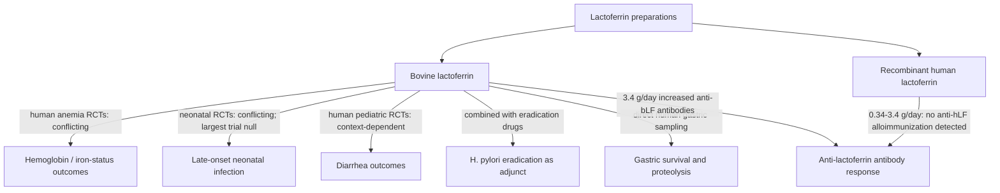
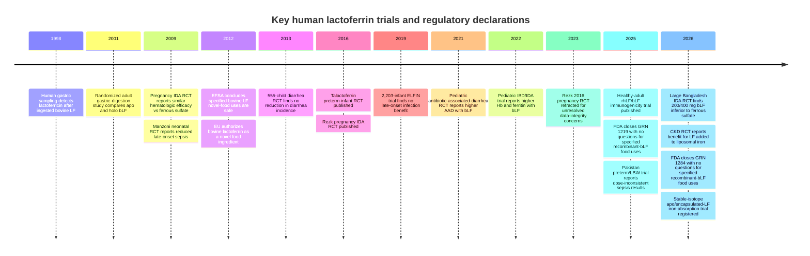

## Summary

**Executive summary.** Lactoferrin is an iron-binding glycoprotein rather than a single small-molecule drug. Human research has used materially different preparations: milk-derived bovine lactoferrin (bLF), recombinant human lactoferrin (rhLF; including talactoferrin and newer food-ingredient preparations), and lactoferrin with different iron saturation states. Those preparations, doses, food matrices, and patient populations should not be treated as interchangeable.

For iron-deficiency anemia, the evidence is conflicting and has changed materially. Older small trials in pregnancy and a small pediatric inflammatory-bowel-disease trial reported hematologic improvement and fewer gastrointestinal complaints relative to ferrous sulfate. However, one prominent positive pregnancy RCT published in 2016 was retracted in 2023 because the journal could not verify the integrity of its data. More importantly, a 2026 double-blind RCT randomized 555 nonpregnant Bangladeshi women with IDA to 200 mg/day bLF, 400 mg/day bLF, or 60 mg/day elemental iron as ferrous sulfate, all with folic acid. At 12 weeks, both bLF doses were inferior to ferrous sulfate for hemoglobin and ferritin. Thus bovine lactoferrin cannot be treated as a generally established substitute for elemental iron. A separate 2026 CKD trial found benefit when lactoferrin was **added to** low-dose liposomal iron; that combination result does not establish lactoferrin monotherapy efficacy.

In infection prevention, early neonatal studies were encouraging, but the largest high-quality trial is negative. The 2,203-participant ELFIN trial found that enteral bLF 150 mg/kg/day did not reduce late-onset infection in very preterm infants (adjusted RR 0.95, 95% CI 0.86–1.04). A 2025 three-arm trial also produced dose-inconsistent results. Accordingly, routine neonatal infection-prevention efficacy is not established. No antiviral-prevention claim is made from cell studies or from ex-vivo immune biomarkers.

Gastrointestinal findings are similarly context-specific. In 555 previously weaned Peruvian children, 1 g/day bLF did not reduce diarrhea incidence, although diarrhea duration and some severity measures were modestly lower. Conversely, in children receiving antibiotics, 100 mg twice daily increased the observed odds of antibiotic-associated diarrhea versus placebo. Older H. pylori trials suggest that bLF can act as an **adjunct** to multidrug eradication therapy, but these combination studies cannot attribute the treatment effect to lactoferrin alone.

Human oral pharmacokinetics remain inadequately characterized. Healthy-adult gastric studies show partial survival of intact bovine lactoferrin and generation of peptide fragments, but no verified systemic elimination half-life is available. Food-regulatory declarations in the EU and FDA GRAS notices are use- and preparation-specific safety/market-status decisions, not declarations of clinical efficacy.

## Description

Lactoferrin is a mammalian iron-binding glycoprotein. In the human literature, the word "lactoferrin" covers several biologically and commercially distinct preparations. Most therapeutic RCTs used **bovine lactoferrin**, generally isolated from cow's milk or whey. **Human lactoferrin** is the endogenous human protein; newer food studies use recombinant human lactoferrin produced in organisms such as *Komagataella phaffii*. **Talactoferrin** is a specific recombinant-human-lactoferrin preparation studied separately and should not be treated as a synonym for bovine lactoferrin.

Iron saturation is another relevant distinction. Lactoferrin has two high-affinity ferric-iron binding sites. "Apo" lactoferrin denotes the relatively iron-depleted form, whereas "holo" lactoferrin denotes iron-saturated protein. The exact percentage iron saturation of clinical products is frequently unspecified. In a randomized human gastric-digestion experiment, a 4.5 g test drink containing approximately 20%-iron-saturated bovine lactoferrin was compared with iron-saturated holo-lactoferrin; substantial intact protein survived gastric transit, with numerically greater survival for holo-lactoferrin. This establishes formulation-dependent gastrointestinal fate, not systemic pharmacokinetics or superior clinical efficacy.

The largest contemporary anemia monotherapy trial specifically described the tested bovine lactoferrin as unsaturated and found that neither 200 nor 400 mg/day corrected IDA as effectively as 60 mg/day elemental iron. A ClinicalTrials.gov record posted in 2026 separately investigates native versus protected/encapsulated apo-lactoferrin, lactoferrin-iron combinations, and ferrous sulfate using stable isotopes in iron-deficient women, underscoring that formulation and iron source remain active research questions rather than settled assumptions.



## Evidence note

The structured records below prioritize primary human evidence. Biomarkers such as hepcidin, IL-6, CRP, immune-cell phenotypes, microbiome composition, or ex-vivo antiviral cytokine responses are not treated as proof of clinical efficacy. Non-human studies are excluded. Trials of mixtures are described as mixture- or adjunct-specific. The absence of a verified oral systemic half-life is retained rather than estimated from digestion studies.

| Study | Design and population | Lactoferrin exposure | Comparator | Main human finding | Safety / key limitation |
|---|---|---|---|---|---|
| Troost 2001 | Randomized crossover; 12 healthy adults | 4.5 g bovine apo/partially iron-saturated or holo-LF, intragastric | Alternate LF forms | Approximate gastric survival 62%-64% for apo preparations and 79% for holo-LF | Gastrointestinal fate only; no systemic half-life |
| Nappi 2009 | Double-blind randomized trial; 100 pregnant women with IDA | bLF 100 mg twice daily for 30 days | Ferrous sulfate 520 mg/day | Both groups improved hematologic measures; no significant between-group efficacy difference reported | Abdominal pain and constipation scores higher with ferrous sulfate; full funding/COI declarations not inspected |
| Manzoni 2009 | Multicenter double-blind RCT; 472 very-low-birth-weight infants | bLF 100 mg/day for 30 days, or 45 days if birthweight <1,000 g | Placebo; separate bLF+LGG arm | bLF-alone late-onset sepsis 5.9% vs 17.3%; RR 0.34 (95% CI 0.17-0.70) | Early, much smaller neonatal trial; later ELFIN result conflicts |
| Ochoa 2013 | Quadruple-masked RCT; 555 previously weaned children aged 12-18 months | bLF 1 g/day for 6 months | Maltodextrin placebo | Diarrhea incidence 5.4 vs 5.2 episodes/child-year, P=0.375; duration 4.8 vs 5.3 days, P=0.046 | No intervention-related adverse events reported |
| Sherman 2016 | Double-blind RCT; 120 preterm infants 750-1,500 g | Recombinant human talactoferrin 150 mg/kg every 12 h for 28 days | Placebo | Hospital-acquired infection rate reported about 50% lower, P<0.04 | Small exploratory efficacy trial; recombinant human product, not bovine LF |
| ELFIN 2019 | Multicenter placebo-controlled RCT; 2,203 very preterm infants | bLF 150 mg/kg/day, max 300 mg/day, to 34 weeks PMA | Sucrose placebo | Late-onset infection adjusted RR 0.95 (95% CI 0.86-1.04), P=0.233; no morbidity/mortality benefit | 16 vs 10 serious AEs; two bLF events judged possibly related |
| Wronowski 2021 | Double-blind RCT; 156 randomized children receiving antibiotics, 150 analyzed | bLF 100 mg twice daily for antibiotic course | Placebo | AAD 21.3% vs 9.3%; OR 2.6 (95% CI 1.02-6.8) | No other product AEs observed; product donated by manufacturer |
| El Amrousy 2022 | Randomized trial; 92 children with IBD-associated IDA randomized, 80 completed | bLF 100 mg/day for 3 months | Ferrous sulfate 6 mg/kg/day | Post-treatment Hb 11.9 vs 10.8 g/dL, P=0.01; ferritin also higher | Small complete-case study; reported side-effect and participant-flow numbers contain inconsistencies |
| Rezk 2016 / retracted 2023 | Randomized pregnancy RCT, n=200 as originally reported | LF 250 mg/day for 8 weeks | Ferrous sulfate | Originally reported superiority | **Retracted** after unresolved concerns regarding integrity of data/results; excluded from affirmative efficacy claims |
| Ariff 2025 | Three-arm double-blind RCT; 305 preterm/LBW neonates | bLF 150 or 300 mg/day for 28 days | Glucose placebo | Culture-proven sepsis 7.8% placebo, 0.98% 150 mg (P=0.020), 4.9% 300 mg (P=0.390); authors did not conclude overall prevention | Small and dose-inconsistent; two deaths in 300-mg arm not attributed to intervention |
| Huda 2026 | Double-blind noninferiority RCT; 555 nonpregnant women with IDA | Unsaturated bLF 200 or 400 mg/day + folic acid for 12 weeks | 60 mg elemental iron as ferrous sulfate + folic acid | Hb change -0.2, 0.0, and +1.1 g/dL respectively; bLF-vs-iron mean differences -1.2 and -1.1 g/dL with CIs excluding noninferiority | Largest direct bLF-vs-ferrous-sulfate RCT; adverse events comparable; 62.9% reached 12-week primary per-protocol assessment |
| Divyaveer 2026 | Open-label randomized trial; 185 adults with CKD-associated IDA | LF 100 mg twice daily **plus** 30 mg/day liposomal iron for 3 months | Liposomal iron alone | Larger Hb increases in both nondialysis and dialysis strata with adjunct LF | Combination result; cannot establish LF monotherapy efficacy |
| Peterson 2025 | Double-blind randomized safety trial; 66 healthy adults | rhLF 0.34 or 3.4 g/day, or bLF 3.4 g/day, for 28 days | Active bLF/rhLF comparison | No anti-hLF alloimmunization detected; bLF increased anti-bLF antibody signal | Helaina-funded; not powered for rare adverse events |

A 2026 ClinicalTrials.gov record, NCT07394972, investigates stabilized/encapsulated apo-lactoferrin, lactoferrin-iron preparations, and ferrous sulfate using stable-isotope fractional iron absorption in women with iron deficiency without anemia. The registry record was last updated on 2026-02-12 and listed "Recruiting" despite a planned May 2026 completion; because no posted results were available in the inspected record, it contributes no efficacy result here.

No clinical antiviral-prevention outcome is inferred from in-vitro or ex-vivo experiments. A 2026 RCT in healthy older adults reported changes in inflammatory and ex-vivo virus-stimulated immune biomarkers after oral lactoferrin, but those are biomarker findings and are not entered as evidence that lactoferrin prevents respiratory viral infection.



## Doses

```yaml
- label: Adult gastric digestion study, apo/partially iron-saturated bovine lactoferrin
  amount: 4.5 g once
  quantity: 4.5
  quantityMax: null
  unit: g
  ingredient: bovine lactoferrin
  formulation: Test drink containing approximately 20%-iron-saturated bovine lactoferrin; studied with and without citrate/citric-acid gastric pH buffer
  route: intragastric via nasogastric intubation
  frequency: single administration
  duration: one study day per crossover condition
  population: 12 healthy adults, mean age approximately 21 years
  purpose: Human gastric survival/digestion study
  sourceCategory: research
  note: Research exposure only; not a recommended oral dose. The study also included an iron-saturated holo-lactoferrin condition.
  sourceId: ref-troost-2001

- label: Adult gastric digestion study, holo-bovine lactoferrin
  amount: 4.5 g once
  quantity: 4.5
  quantityMax: null
  unit: g
  ingredient: iron-saturated bovine lactoferrin
  formulation: Holo-lactoferrin test drink
  route: intragastric via nasogastric intubation
  frequency: single administration
  duration: one study day in randomized crossover
  population: 12 healthy adults
  purpose: Human gastric survival/digestion study
  sourceCategory: research
  note: Iron saturation affected measured gastric survival; the study did not establish systemic exposure or half-life.
  sourceId: ref-troost-2001

- label: Pregnancy iron-deficiency anemia trial
  amount: 100 mg twice daily
  quantity: 200
  quantityMax: null
  unit: mg/day
  ingredient: bovine lactoferrin
  formulation: 100 mg bovine lactoferrin capsule
  route: oral
  frequency: twice daily
  duration: 30 days
  population: Pregnant women with iron-deficiency anemia
  purpose: Comparison with ferrous sulfate for hematologic efficacy and gastrointestinal tolerability
  sourceCategory: research
  note: Comparator was ferrous sulfate 520 mg once daily; iron saturation of the lactoferrin preparation was not specified in the accessible abstract.
  sourceId: ref-nappi-2009

- label: Nonpregnant women with iron-deficiency anemia
  amount: 200-400 mg daily
  quantity: 200
  quantityMax: 400
  unit: mg/day
  ingredient: bovine lactoferrin
  formulation: Unsaturated bovine lactoferrin in gelatin capsules; each arm also received 400 micrograms folic acid daily
  route: oral
  frequency: once daily
  duration: 12 weeks
  population: Nonpregnant, nonlactating Bangladeshi women aged 18-49 years with iron-deficiency anemia
  purpose: Noninferiority comparison with 60 mg elemental iron as ferrous sulfate
  sourceCategory: research
  note: Exact percentage iron saturation was not quantitatively reported in the inspected publication; the authors characterized the tested bLF as unsaturated.
  sourceId: ref-huda-2026

- label: Pediatric IBD-associated iron-deficiency anemia
  amount: 100 mg daily
  quantity: 100
  quantityMax: null
  unit: mg/day
  ingredient: bovine lactoferrin
  formulation: Pravotin sachet, Hygint, Egypt
  route: oral
  frequency: once daily
  duration: 3 months
  population: Children aged 5-18 years with inflammatory bowel disease in remission and iron-deficiency anemia
  purpose: Comparison with ferrous sulfate 6 mg/kg/day
  sourceCategory: research
  note: Ninety-two children were randomized; 80 completed and were analyzed.
  sourceId: ref-elamrousy-2022

- label: Prevention of diarrhea after weaning
  amount: 1 g daily
  quantity: 1
  quantityMax: null
  unit: g/day
  ingredient: bovine lactoferrin
  formulation: Daily bovine lactoferrin supplement
  route: oral
  frequency: daily
  duration: 6 months
  population: Previously weaned Peruvian children enrolled at 12-18 months of age
  purpose: Prevention of diarrhea and assessment of growth
  sourceCategory: research
  note: Dose is confirmed in the ClinicalTrials.gov registry; the trial did not reduce diarrhea incidence.
  sourceId: ref-ochoa-diarrhea-2013

- label: Pediatric antibiotic-associated diarrhea prevention trial
  amount: 100 mg twice daily
  quantity: 200
  quantityMax: null
  unit: mg/day
  ingredient: bovine lactoferrin
  formulation: 100 mg bLF plus 900 mg maltodextrin per dose
  route: oral
  frequency: twice daily
  duration: for the entire antibiotic-treatment course
  population: Children aged 1-18 years receiving antibiotics for acute respiratory or urinary tract infection
  purpose: Prevention of antibiotic-associated diarrhea
  sourceCategory: research
  note: This exposure was associated with more antibiotic-associated diarrhea than placebo in the randomized trial.
  sourceId: ref-wronowski-2021

- label: Very-low-birth-weight neonatal sepsis-prevention trial
  amount: 100 mg daily
  quantity: 100
  quantityMax: null
  unit: mg/day
  ingredient: bovine lactoferrin
  formulation: Oral bovine lactoferrin, with a separate combination arm also receiving Lactobacillus rhamnosus GG
  route: oral/enteral
  frequency: daily
  duration: 30 days; 45 days for neonates below 1000 g birthweight
  population: Very-low-birth-weight neonates under 1500 g
  purpose: Prevention of late-onset sepsis
  sourceCategory: research
  note: The bLF-alone result must be distinguished from the bLF-plus-probiotic arm.
  sourceId: ref-manzoni-2009

- label: ELFIN very-preterm infant trial
  amount: 150 mg/kg/day, maximum 300 mg/day
  quantity: 150
  quantityMax: 300
  unit: mg/kg/day with 300 mg/day maximum
  ingredient: bovine lactoferrin
  formulation: Tatua Co-operative Dairy Company bovine lactoferrin prepared under clinical-trial pharmacy GMP controls
  route: enteral via gastric tube
  frequency: once daily, with splitting permitted at clinician discretion
  duration: from establishment of sufficient enteral feeding until 34 weeks postmenstrual age
  population: Infants born before 32 weeks gestation and randomized before 72 hours of age
  purpose: Prevention of late-onset infection and associated morbidity
  sourceCategory: research
  note: Largest neonatal bLF RCT; primary outcome was null.
  sourceId: ref-elfin-2019

- label: Recombinant human talactoferrin preterm-infant trial
  amount: 150 mg/kg every 12 hours
  quantity: 300
  quantityMax: null
  unit: mg/kg/day
  ingredient: recombinant human lactoferrin (talactoferrin)
  formulation: Talactoferrin oral solution
  route: enteral
  frequency: every 12 hours
  duration: days 1-28 of life
  population: Preterm infants with birthweight 750-1500 g
  purpose: Safety and exploratory prevention of hospital-acquired infection
  sourceCategory: research
  note: This recombinant human product should not be pooled uncritically with bovine lactoferrin preparations.
  sourceId: ref-sherman-2016

- label: H. pylori eradication adjunct trial
  amount: 200 mg twice daily
  quantity: 400
  quantityMax: null
  unit: mg/day
  ingredient: bovine lactoferrin
  formulation: Oral bovine lactoferrin added to esomeprazole, clarithromycin, and tinidazole in the concurrent-treatment arm
  route: oral
  frequency: twice daily
  duration: 7 days
  population: Adults with confirmed Helicobacter pylori infection
  purpose: Adjunct to H. pylori triple-eradication therapy
  sourceCategory: research
  note: The relevant positive result is combination-specific and does not establish lactoferrin monotherapy eradication efficacy.
  sourceId: ref-dimario-2006

- label: Healthy-adult recombinant human lactoferrin safety study
  amount: 0.34-3.4 g daily
  quantity: 0.34
  quantityMax: 3.4
  unit: g/day
  ingredient: recombinant human lactoferrin
  formulation: Helaina effera recombinant human lactoferrin produced in Komagataella phaffii; powder mixed in water
  route: oral
  frequency: two divided servings daily
  duration: 28 days
  population: Healthy adults aged 18-45 years
  purpose: Immunogenicity/alloimmunization and safety evaluation
  sourceCategory: research
  note: Follow-up continued through day 84; study was industry-funded.
  sourceId: ref-peterson-2025

- label: Healthy-adult bovine-lactoferrin active-control safety exposure
  amount: 3.4 g daily
  quantity: 3.4
  quantityMax: null
  unit: g/day
  ingredient: bovine lactoferrin
  formulation: Powder mixed in water
  route: oral
  frequency: two divided servings daily
  duration: 28 days
  population: Healthy adults aged 18-45 years
  purpose: Active-control immunogenicity and safety comparison with recombinant human lactoferrin
  sourceCategory: research
  note: Increased anti-bovine-lactoferrin antibody signal was observed without a corresponding clinical adverse-event signal in this small study.
  sourceId: ref-peterson-2025

- label: CKD-associated iron-deficiency anemia adjunct trial
  amount: 100 mg twice daily plus 30 mg/day liposomal iron
  quantity: 200
  quantityMax: null
  unit: mg/day
  ingredient: lactoferrin
  formulation: Oral lactoferrin added to oral liposomal iron
  route: oral
  frequency: lactoferrin twice daily; liposomal iron daily
  duration: 3 months
  population: Adults with iron-deficiency anemia and nondialysis or dialysis-dependent chronic kidney disease
  purpose: Adjunctive treatment compared with liposomal iron alone
  sourceCategory: research
  note: Combination exposure; the trial does not establish lactoferrin monotherapy efficacy.
  sourceId: ref-divyaveer-2026

- label: Low-birth-weight/preterm neonatal dose-ranging trial
  amount: 150 or 300 mg daily
  quantity: 150
  quantityMax: 300
  unit: mg/day
  ingredient: bovine lactoferrin
  formulation: bLF mixed with breast milk
  route: enteral
  frequency: once daily
  duration: 28 days
  population: Preterm 28 to 36+5 week or low-birth-weight neonates 1000 to under 2500 g who established enteral feeding
  purpose: Prevention of late-onset sepsis and necrotizing enterocolitis
  sourceCategory: research
  note: Culture-proven sepsis results were dose-inconsistent; authors did not conclude overall prevention.
  sourceId: ref-ariff-2025
```

## Pharmacokinetics

```yaml
- id: pk-intact-lactoferrin-half-life-not-established
  analyte: intact orally administered lactoferrin
  route: oral/enteral
  formulation: bovine lactoferrin; human oral studies include apo/partially iron-saturated and holo forms
  population: Humans; systemic elimination kinetics were not established in the inspected oral studies
  endpoint: elimination-half-life
  statistic: not-established
  value: null
  low: null
  high: null
  unit: hours
  context: Human gastric studies measured survival and proteolytic processing rather than plasma elimination. No verified systemic elimination half-life for intact oral lactoferrin was identified, so no elimination curve should be generated.
  sourceId: ref-troost-2001
  modelEligible: false
```

## Modifiers

```yaml
[]
```

## Effects

```yaml
[]
```

## Outcomes

```yaml
- id: hb-ida-women-blf200-2026
  conceptId: hemoglobin-concentration
  name: Hemoglobin change with 200 mg/day bovine lactoferrin in nonpregnant IDA
  direction: Decreased
  evidence: Human research
  description: Compared with ferrous sulfate, 200 mg/day unsaturated bovine lactoferrin produced substantially less improvement in hemoglobin at 12 weeks and failed the prespecified noninferiority criterion.
  sourceId: ref-huda-2026
  population: Nonpregnant Bangladeshi women aged 18-49 years with iron-deficiency anemia
  exposure: 200 mg/day bovine lactoferrin plus 400 micrograms/day folic acid for 12 weeks
  instrument: Change in blood hemoglobin concentration from baseline
  magnitude: Mean Hb change was -0.2 g/dL with 200 mg bLF versus +1.1 g/dL with 60 mg elemental iron as ferrous sulfate.
  reportType: measured-assessment
  conflictingSourceIds:
    - ref-nappi-2009
    - ref-elamrousy-2022
  study:
    id: ACTRN12617001455358
    design: Double-blind, parallel-group randomized noninferiority trial
    sampleSize: 555
    populationLabels:
      - nonpregnant women
      - iron-deficiency anemia
      - Bangladesh
    comparator: 60 mg elemental iron as ferrous sulfate plus 400 micrograms folic acid daily
    route: oral
    formulation: unsaturated bovine lactoferrin capsule
    durationDays: 84
    assessmentTime: 12 weeks
  result:
    measure: mean-difference
    estimate: -1.2
    unit: g/dL
    instrument: Change in hemoglobin concentration from baseline
    comparator: 60 mg elemental iron as ferrous sulfate plus folic acid
    assessmentTime: 12 weeks
    population: Per-protocol nonpregnant women with IDA
    confidenceInterval:
      lower: -1.6
      upper: -0.9
      level: 95

- id: hb-ida-women-blf400-2026
  conceptId: hemoglobin-concentration
  name: Hemoglobin change with 400 mg/day bovine lactoferrin in nonpregnant IDA
  direction: Decreased
  evidence: Human research
  description: Compared with ferrous sulfate, 400 mg/day unsaturated bovine lactoferrin produced substantially less improvement in hemoglobin at 12 weeks and failed the prespecified noninferiority criterion.
  sourceId: ref-huda-2026
  population: Nonpregnant Bangladeshi women aged 18-49 years with iron-deficiency anemia
  exposure: 400 mg/day bovine lactoferrin plus 400 micrograms/day folic acid for 12 weeks
  instrument: Change in blood hemoglobin concentration from baseline
  magnitude: Mean Hb change was 0.0 g/dL with 400 mg bLF versus +1.1 g/dL with ferrous sulfate.
  reportType: measured-assessment
  conflictingSourceIds:
    - ref-nappi-2009
    - ref-elamrousy-2022
  study:
    id: ACTRN12617001455358
    design: Double-blind, parallel-group randomized noninferiority trial
    sampleSize: 555
    populationLabels:
      - nonpregnant women
      - iron-deficiency anemia
      - Bangladesh
    comparator: 60 mg elemental iron as ferrous sulfate plus 400 micrograms folic acid daily
    route: oral
    formulation: unsaturated bovine lactoferrin capsule
    durationDays: 84
    assessmentTime: 12 weeks
  result:
    measure: mean-difference
    estimate: -1.1
    unit: g/dL
    instrument: Change in hemoglobin concentration from baseline
    comparator: 60 mg elemental iron as ferrous sulfate plus folic acid
    assessmentTime: 12 weeks
    population: Per-protocol nonpregnant women with IDA
    confidenceInterval:
      lower: -1.4
      upper: -0.8
      level: 95

- id: ferritin-ida-women-blf200-2026
  conceptId: serum-ferritin
  name: Serum ferritin change with 200 mg/day bovine lactoferrin
  direction: Decreased
  evidence: Human research
  description: Ferritin increased only modestly with 200 mg/day bLF and substantially more with ferrous sulfate.
  sourceId: ref-huda-2026
  population: Nonpregnant Bangladeshi women with iron-deficiency anemia
  exposure: 200 mg/day bLF plus folic acid for 12 weeks
  instrument: Serum ferritin
  magnitude: Mean ferritin change was +3.2 micrograms/L with bLF versus +41.4 micrograms/L with ferrous sulfate.
  reportType: measured-assessment
  study:
    id: ACTRN12617001455358
    design: Double-blind randomized noninferiority trial
    sampleSize: 555
    populationLabels:
      - nonpregnant women
      - iron-deficiency anemia
    comparator: 60 mg elemental iron as ferrous sulfate plus folic acid
    route: oral
    formulation: unsaturated bovine lactoferrin
    durationDays: 84
    assessmentTime: 12 weeks
  result:
    measure: mean-difference
    estimate: -38.2
    unit: micrograms/L
    instrument: Change in serum ferritin from baseline
    comparator: ferrous sulfate plus folic acid
    assessmentTime: 12 weeks
    population: Per-protocol nonpregnant women with IDA
    confidenceInterval:
      lower: -45.4
      upper: -31.1
      level: 95

- id: ferritin-ida-women-blf400-2026
  conceptId: serum-ferritin
  name: Serum ferritin change with 400 mg/day bovine lactoferrin
  direction: Decreased
  evidence: Human research
  description: Ferritin increased only modestly with 400 mg/day bLF and substantially more with ferrous sulfate.
  sourceId: ref-huda-2026
  population: Nonpregnant Bangladeshi women with iron-deficiency anemia
  exposure: 400 mg/day bLF plus folic acid for 12 weeks
  instrument: Serum ferritin
  magnitude: Mean ferritin change was +3.5 micrograms/L with bLF versus +41.4 micrograms/L with ferrous sulfate.
  reportType: measured-assessment
  study:
    id: ACTRN12617001455358
    design: Double-blind randomized noninferiority trial
    sampleSize: 555
    populationLabels:
      - nonpregnant women
      - iron-deficiency anemia
    comparator: 60 mg elemental iron as ferrous sulfate plus folic acid
    route: oral
    formulation: unsaturated bovine lactoferrin
    durationDays: 84
    assessmentTime: 12 weeks
  result:
    measure: mean-difference
    estimate: -37.9
    unit: micrograms/L
    instrument: Change in serum ferritin from baseline
    comparator: ferrous sulfate plus folic acid
    assessmentTime: 12 weeks
    population: Per-protocol nonpregnant women with IDA
    confidenceInterval:
      lower: -45.0
      upper: -30.8
      level: 95

- id: hb-pregnancy-ida-nappi-2009
  conceptId: hemoglobin-concentration
  name: Hemoglobin response in pregnant women with IDA
  direction: Variable
  evidence: Human research
  description: Hemoglobin increased during 30 days of both bovine lactoferrin and ferrous-sulfate treatment; the trial abstract reported no significant between-group difference.
  sourceId: ref-nappi-2009
  population: Pregnant women with iron-deficiency anemia
  exposure: Bovine lactoferrin 100 mg twice daily for 30 days
  instrument: Hemoglobin concentration
  magnitude: Both treatments significantly increased Hb from baseline; no significant between-group difference was reported in the accessible abstract.
  reportType: measured-assessment
  conflictingSourceIds:
    - ref-huda-2026
  study:
    id: nappi-2009-pregnancy-ida
    design: Prospective randomized controlled double-blind trial
    sampleSize: 100
    populationLabels:
      - pregnancy
      - iron-deficiency anemia
    comparator: Ferrous sulfate 520 mg once daily
    route: oral
    formulation: bovine lactoferrin capsule
    durationDays: 30
    assessmentTime: 30 days

- id: gi-tolerability-pregnancy-nappi-2009
  conceptId: gastrointestinal-adverse-events
  name: Gastrointestinal symptoms versus ferrous sulfate in pregnancy
  direction: Decreased
  evidence: Human research
  description: Abdominal-pain and constipation symptom scores were significantly lower with bovine lactoferrin than with ferrous sulfate.
  sourceId: ref-nappi-2009
  population: Pregnant women with iron-deficiency anemia
  exposure: Bovine lactoferrin 100 mg twice daily for 30 days
  instrument: Participant diary rating abdominal pain, nausea, vomiting, diarrhea, and constipation from 0 absent to 3 severe
  magnitude: Median abdominal-pain and constipation scores were significantly higher with ferrous sulfate; exact between-group effect estimates were not available in the accessible abstract.
  reportType: measured-assessment
  study:
    id: nappi-2009-pregnancy-ida
    design: Prospective randomized controlled double-blind trial
    sampleSize: 100
    populationLabels:
      - pregnancy
      - iron-deficiency anemia
    comparator: Ferrous sulfate 520 mg/day
    route: oral
    formulation: bovine lactoferrin
    durationDays: 30
    assessmentTime: 30 days

- id: hb-pediatric-ibd-ida-2022
  conceptId: hemoglobin-concentration
  name: Hemoglobin in children with IBD-associated IDA
  direction: Increased
  evidence: Human research
  description: Among study completers, post-treatment hemoglobin was higher with bovine lactoferrin than with ferrous sulfate after 3 months.
  sourceId: ref-elamrousy-2022
  population: Children aged 5-18 years with IBD in remission and IDA
  exposure: Bovine lactoferrin 100 mg/day for 3 months
  instrument: Hemoglobin concentration
  magnitude: Post-treatment Hb was 11.9 ± 1.7 g/dL with bLF versus 10.8 ± 0.49 g/dL with ferrous sulfate; reported P=0.01.
  reportType: measured-assessment
  conflictingSourceIds:
    - ref-huda-2026
  study:
    id: PACTR202002763901803
    design: Randomized controlled trial with complete-case analysis
    sampleSize: 92
    populationLabels:
      - children
      - inflammatory bowel disease
      - iron-deficiency anemia
    comparator: Ferrous sulfate 6 mg/kg/day
    route: oral
    formulation: Pravotin bovine lactoferrin sachet
    durationDays: 90
    assessmentTime: 3 months

- id: gi-adverse-events-pediatric-ibd-2022
  conceptId: gastrointestinal-adverse-events
  name: Gastrointestinal adverse events in pediatric IBD-associated IDA
  direction: Decreased
  evidence: Human research
  description: The study reported substantially fewer gastrointestinal complaints with lactoferrin than with ferrous sulfate, but participant-flow and side-effect denominators are internally difficult to reconcile and should be interpreted cautiously.
  sourceId: ref-elamrousy-2022
  population: Children with IBD in remission and IDA
  exposure: Bovine lactoferrin 100 mg/day for 3 months
  instrument: Parent-recorded treatment side effects
  magnitude: The article reports abdominal discomfort in one lactoferrin participant (2.5%) versus gastrointestinal side effects in 18 ferrous-sulfate participants (46.2%).
  reportType: measured-assessment
  study:
    id: PACTR202002763901803
    design: Randomized controlled trial with complete-case analysis
    sampleSize: 92
    populationLabels:
      - children
      - inflammatory bowel disease
      - iron-deficiency anemia
    comparator: Ferrous sulfate 6 mg/kg/day
    route: oral
    formulation: Pravotin bovine lactoferrin sachet
    durationDays: 90
    assessmentTime: 3 months

- id: hb-ckd-adjunct-2026
  conceptId: hemoglobin-concentration
  name: Hemoglobin response when lactoferrin was added to liposomal iron in CKD
  direction: Increased
  evidence: Human research
  description: Addition of lactoferrin to 30 mg/day liposomal iron produced larger mean hemoglobin increases than liposomal iron alone in both nondialysis and dialysis-dependent CKD strata.
  sourceId: ref-divyaveer-2026
  population: Adults with CKD-associated iron-deficiency anemia, including nondialysis and dialysis-dependent CKD
  exposure: Lactoferrin 100 mg twice daily plus liposomal iron 30 mg/day for 3 months
  instrument: Hemoglobin concentration
  magnitude: Mean Hb increase was 1.95 ± 1.19 vs 1.33 ± 0.86 g/dL in CKD-ND and 1.73 ± 0.96 vs 1.11 ± 0.93 g/dL in CKD-5D for combination versus iron alone.
  reportType: measured-assessment
  study:
    id: divyaveer-ckd-ida-2026
    design: Randomized open-label trial
    sampleSize: 185
    populationLabels:
      - chronic kidney disease
      - iron-deficiency anemia
      - adults
    comparator: Liposomal iron 30 mg/day alone
    route: oral
    formulation: lactoferrin plus liposomal iron
    durationDays: 90
    assessmentTime: 3 months

- id: late-onset-sepsis-vlbw-2009
  conceptId: late-onset-infection
  name: Late-onset sepsis in very-low-birth-weight neonates
  direction: Decreased
  evidence: Human research
  description: The early multicenter RCT reported substantially fewer first late-onset-sepsis episodes with bovine lactoferrin alone than with placebo.
  sourceId: ref-manzoni-2009
  population: Very-low-birth-weight neonates under 1500 g
  exposure: Bovine lactoferrin 100 mg/day for 30 or 45 days
  instrument: First episode of late-onset sepsis with pathogen isolation from blood, peritoneal fluid, or cerebrospinal fluid
  magnitude: 9/153 (5.9%) with bLF versus 29/168 (17.3%) with placebo.
  reportType: measured-assessment
  conflictingSourceIds:
    - ref-elfin-2019
    - ref-ariff-2025
  study:
    id: ISRCTN53107700
    design: Prospective multicenter double-blind placebo-controlled randomized trial
    sampleSize: 472
    populationLabels:
      - very-low-birth-weight neonates
      - neonatal intensive care
    comparator: Placebo
    route: oral
    formulation: bovine lactoferrin
    durationDays: 45
    assessmentTime: Through discharge
  result:
    measure: risk-ratio
    estimate: 0.34
    unit: ratio
    instrument: First episode of late-onset sepsis
    comparator: placebo
    assessmentTime: Through neonatal hospitalization
    population: Very-low-birth-weight neonates
    confidenceInterval:
      lower: 0.17
      upper: 0.70
      level: 95

- id: late-onset-infection-elfin-2019
  conceptId: late-onset-infection
  name: Late-onset infection in very preterm infants
  direction: Variable
  evidence: Human research
  description: The largest neonatal lactoferrin trial found no statistically significant reduction in microbiologically confirmed or clinically suspected late-onset infection.
  sourceId: ref-elfin-2019
  population: Infants born before 32 weeks gestation
  exposure: Bovine lactoferrin 150 mg/kg/day, maximum 300 mg/day, until 34 weeks postmenstrual age
  instrument: Microbiologically confirmed or clinically suspected late-onset infection occurring more than 72 hours after birth
  magnitude: 316/1093 (28.9%) with bLF versus 334/1089 (30.7%) with placebo.
  reportType: measured-assessment
  conflictingSourceIds:
    - ref-manzoni-2009
  study:
    id: ISRCTN88261002
    design: Multicenter randomized placebo-controlled masked trial
    sampleSize: 2203
    populationLabels:
      - very preterm infants
      - United Kingdom
    comparator: Sucrose placebo
    route: enteral
    formulation: bovine lactoferrin
    assessmentTime: Trial entry to hospital discharge
  result:
    measure: risk-ratio
    estimate: 0.95
    unit: ratio
    instrument: Microbiologically confirmed or clinically suspected late-onset infection
    comparator: sucrose placebo
    assessmentTime: Trial entry to hospital discharge
    population: Very preterm infants with primary-outcome data
    confidenceInterval:
      lower: 0.86
      upper: 1.04
      level: 95

- id: late-onset-sepsis-dose-ranging-2025
  conceptId: late-onset-infection
  name: Dose-ranging late-onset sepsis outcome in preterm/LBW neonates
  direction: Variable
  evidence: Human research
  description: Culture-proven sepsis was lower in the 150 mg/day arm but not significantly lower in the 300 mg/day arm; the authors concluded that the trial did not establish prevention of late-onset sepsis.
  sourceId: ref-ariff-2025
  population: Preterm and low-birth-weight neonates in Pakistan
  exposure: Bovine lactoferrin 150 or 300 mg/day for 28 days
  instrument: Culture-proven late-onset sepsis
  magnitude: 8/102 (7.8%) placebo, 1/102 (0.98%) 150 mg bLF (P=0.020), and 5/101 (4.9%) 300 mg bLF (P=0.390).
  reportType: measured-assessment
  conflictingSourceIds:
    - ref-manzoni-2009
    - ref-elfin-2019
  study:
    id: ariff-pakistan-lbw-2025
    design: Three-arm double-blind placebo-controlled randomized trial
    sampleSize: 305
    populationLabels:
      - preterm neonates
      - low birth weight
      - Pakistan
    comparator: D-glucose placebo
    route: enteral
    formulation: bovine lactoferrin mixed with breast milk
    durationDays: 28
    assessmentTime: 28 days

- id: diarrhea-incidence-peru-2013
  conceptId: diarrhea-incidence
  name: Diarrhea incidence in previously weaned children
  direction: Variable
  evidence: Human research
  description: Six months of bovine lactoferrin did not significantly reduce the primary incidence outcome.
  sourceId: ref-ochoa-diarrhea-2013
  population: Previously weaned Peruvian children enrolled at 12-18 months
  exposure: Bovine lactoferrin 1 g/day for 6 months
  instrument: Prospectively observed diarrhea episodes during daily home visits
  magnitude: 5.4 versus 5.2 episodes per child-year for bLF and placebo, respectively; P=0.375.
  reportType: measured-assessment
  study:
    id: NCT00560222
    design: Community-based quadruple-masked randomized placebo-controlled trial
    sampleSize: 555
    populationLabels:
      - previously weaned children
      - Peru
    comparator: Maltodextrin placebo
    route: oral
    formulation: bovine lactoferrin
    durationDays: 180
    assessmentTime: 6 months

- id: diarrhea-duration-peru-2013
  conceptId: diarrhea-duration
  name: Duration of diarrhea episodes in previously weaned children
  direction: Decreased
  evidence: Human research
  description: Median diarrhea-episode duration was modestly shorter with bovine lactoferrin despite no reduction in diarrhea incidence.
  sourceId: ref-ochoa-diarrhea-2013
  population: Previously weaned Peruvian children enrolled at 12-18 months
  exposure: Bovine lactoferrin 1 g/day for 6 months
  instrument: Duration of prospectively recorded diarrhea episodes
  magnitude: Median episode duration 4.8 days with bLF versus 5.3 days with placebo; P=0.046.
  reportType: measured-assessment
  study:
    id: NCT00560222
    design: Community-based quadruple-masked randomized placebo-controlled trial
    sampleSize: 555
    populationLabels:
      - previously weaned children
      - Peru
    comparator: Maltodextrin placebo
    route: oral
    formulation: bovine lactoferrin
    durationDays: 180
    assessmentTime: 6 months

- id: antibiotic-associated-diarrhea-2021
  conceptId: antibiotic-associated-diarrhea
  name: Antibiotic-associated diarrhea in children
  direction: Increased
  evidence: Human research
  description: Bovine lactoferrin did not prevent pediatric antibiotic-associated diarrhea; the prespecified outcome occurred more often in the bLF arm.
  sourceId: ref-wronowski-2021
  population: Children aged 1-18 years receiving antibiotics for respiratory or urinary tract infection
  exposure: Bovine lactoferrin 100 mg twice daily for the antibiotic-treatment course
  instrument: Protocol-defined antibiotic-associated diarrhea during treatment and up to 2 weeks afterward
  magnitude: 16/75 (21.3%) with bLF versus 7/75 (9.3%) with placebo.
  reportType: measured-assessment
  study:
    id: NCT02626104
    design: Prospective randomized double-blind placebo-controlled trial
    sampleSize: 156
    populationLabels:
      - children
      - concurrent antibiotic treatment
    comparator: Maltodextrin placebo
    route: oral
    formulation: bovine lactoferrin plus maltodextrin
    assessmentTime: During antibiotic therapy and 14 days afterward
  result:
    measure: odds-ratio
    estimate: 2.6
    unit: ratio
    instrument: Protocol-defined antibiotic-associated diarrhea
    comparator: placebo
    assessmentTime: Antibiotic course through 14-day follow-up
    population: Intention-to-treat analyzed children
    confidenceInterval:
      lower: 1.02
      upper: 6.8
      level: 95

- id: hpylori-eradication-adjunct-2006
  conceptId: helicobacter-pylori-eradication
  name: H. pylori eradication when bovine lactoferrin was added to triple therapy
  direction: Increased
  evidence: Human research
  description: Concurrent bovine lactoferrin plus esomeprazole/clarithromycin/tinidazole produced a higher eradication proportion than the same triple therapy without lactoferrin; this is an adjunctive-combination result.
  sourceId: ref-dimario-2006
  population: Adults with H. pylori infection
  exposure: Bovine lactoferrin 200 mg twice daily during 7-day triple therapy
  instrument: Post-treatment H. pylori eradication testing
  magnitude: Intention-to-treat eradication was 90% in the concurrent-lactoferrin arm versus 77% with triple therapy alone; overall group comparison P<0.01.
  reportType: measured-assessment
  study:
    id: dimario-multicenter-hpylori-2006
    design: Prospective open randomized multicenter trial
    sampleSize: 402
    populationLabels:
      - adults
      - Helicobacter pylori infection
    comparator: Esomeprazole, clarithromycin, and tinidazole without lactoferrin
    route: oral
    formulation: bovine lactoferrin as adjunct to multidrug therapy
    durationDays: 7
    assessmentTime: After eradication therapy

- id: anti-lf-antibody-response-2025
  conceptId: anti-lactoferrin-antibody-response
  name: Anti-lactoferrin antibody response to bovine versus recombinant human lactoferrin
  direction: Variable
  evidence: Human research
  description: The bovine-lactoferrin group developed a larger anti-bLF antibody signal, whereas neither recombinant-human-lactoferrin dose produced evidence of increased anti-hLF antibodies or alloimmunization under the protocol conditions.
  sourceId: ref-peterson-2025
  population: Healthy adults aged 18-45 years
  exposure: bLF 3.4 g/day, rhLF 0.34 g/day, or rhLF 3.4 g/day for 28 days
  instrument: Serum anti-bLF and anti-hLF bridging electrochemiluminescence assays; post/pre antibody-signal ratio
  magnitude: Day-56 post/pre LS geometric mean was 3.01 (95% CI 2.08-4.35) for anti-bLF in the bLF group, 1.07 (0.77-1.49) for anti-hLF in low-dose rhLF, and 1.02 (0.62-1.70) for anti-hLF in high-dose rhLF.
  reportType: measured-assessment
  study:
    id: NCT06012669
    design: Randomized double-blind parallel-arm active-controlled safety trial
    sampleSize: 66
    populationLabels:
      - healthy adults
      - immunogenicity study
    comparator: Bovine versus recombinant human lactoferrin
    route: oral
    formulation: Helaina recombinant human lactoferrin or bovine lactoferrin powder in water
    durationDays: 28
    assessmentTime: Day 56 primary antibody assessment
```

## Mechanisms

```yaml
- title: Human gastric survival depends on lactoferrin preparation and iron saturation
  description: In a randomized crossover experiment in 12 healthy adults given 4.5 g bovine lactoferrin intragastrically, measured gastric survival was approximately 64% for buffered apo/partially iron-saturated LF, 62% for unbuffered apo/partially iron-saturated LF, and 79% for holo-LF. This establishes substantial and formulation-dependent gastric survival in humans but does not establish systemic absorption, elimination half-life, or clinical efficacy.
  sourceId: ref-troost-2001
  conceptId: gastric-processing-of-lactoferrin

- title: Gastric proteolysis can generate lactoferricin-containing fragments in humans
  description: Direct gastric sampling from an adult 10 minutes after ingestion of bovine lactoferrin detected lactoferricin and incompletely hydrolyzed lactoferrin fragments containing the lactoferricin region. The evidence demonstrates human gastric peptide generation but comes from a very small direct-sampling experiment and does not prove an antimicrobial clinical effect.
  sourceId: ref-kuwata-1998
  conceptId: gastric-processing-of-lactoferrin

- title: Hepcidin and inflammatory biomarkers may accompany iron-status responses but do not establish efficacy
  description: In children with IBD-associated IDA, 100 mg/day bLF was accompanied by decreases in IL-6 and hepcidin alongside improved hematologic measures. In contrast, the large 2026 Bangladesh trial showed much smaller hepcidin increases with bLF than with ferrous sulfate but no meaningful hemoglobin or ferritin efficacy. Human data therefore support a relationship with iron-homeostasis biomarkers without establishing that hepcidin modulation reliably translates into clinical anemia correction.
  sourceId: ref-huda-2026
  conceptId: hepcidin-linked-iron-homeostasis
```

## Cautions

```yaml
- title: Bovine lactoferrin is a cow's-milk-derived protein
  description: Multiple human trials excluded participants with cow's-milk allergy or hypersensitivity, and EU labeling specifies "Lactoferrin from cows' milk." Safety findings from screened trial populations should not be generalized to people with known cow's-milk-protein allergy.
  sourceId: ref-huda-2026

- title: Bovine, human, recombinant-human, apo, holo, and protected formulations are not interchangeable
  description: Human trials used preparations differing by species sequence, expression system, iron saturation, food matrix, encapsulation, and co-interventions. Results from one preparation should not automatically be transferred to another.
  sourceId: ref-peterson-2025

- title: A prominent positive pregnancy anemia trial was retracted
  description: The 2016 Rezk et al. randomized pregnancy trial was retracted in 2023 after the journal and publisher reported significant concerns about integrity of the data and results and inability to obtain original data or sufficient supporting information. Its efficacy result is not used as affirmative evidence here.
  sourceId: ref-rezk-retraction-2023

- title: Antibiotic-associated diarrhea signal
  description: In a blinded pediatric RCT, antibiotic-associated diarrhea occurred more often with 100 mg bovine lactoferrin twice daily than with placebo. The trial did not establish a pharmacokinetic drug interaction or mechanism, but the result argues against assuming gastrointestinal benefit during concurrent antibiotic treatment.
  sourceId: ref-wronowski-2021

- title: Serious adverse events occurred in the ELFIN neonatal trial
  description: ELFIN recorded 16 serious adverse events in the bLF arm and 10 in controls. Investigators assessed two events in the bLF group, blood in stool and a death after intestinal perforation, as possibly related to the intervention. The trial did not demonstrate an overall infection-prevention benefit.
  sourceId: ref-elfin-2019

- title: Product quality and manufacturing controls vary across studies
  description: The ELFIN investigational bLF underwent clinical-trial pharmacy checks of purity, uniformity, sterility, stability, and GMP processing, whereas other studies used commercial sachets, formula ingredients, recombinant products, or donated preparations. The pediatric AAD investigators specifically discussed possible preparation-related variables such as endotoxin contamination and reported that their tested product had negative cultures and a manufacturer certificate describing it as LPS-free. Product-specific findings should not be generalized to uncharacterized supplements.
  sourceId: ref-wronowski-2021

- title: Biomarker modulation is not equivalent to clinical infection prevention or anemia treatment
  description: Lactoferrin can alter hepcidin, inflammatory markers, immune-cell populations, ex-vivo cytokine responses, antibody signals, and microbiome measurements in human studies. Those endpoints are biologically informative but are not substitutes for clinical outcomes such as corrected anemia, fewer infections, or reduced hospitalization.
  sourceId: ref-berthon-2026

- title: Healthy-adult recombinant-human-lactoferrin safety trial was industry-funded
  description: The 2025 rhLF/bLF safety study was funded by Helaina Inc.; company employees held equity and the sponsor was involved in study design, data interpretation, report writing, and the decision to submit. No alloimmunization signal or increased clinical adverse events was identified under the protocol, but the study was small and explicitly not powered for rare adverse events.
  sourceId: ref-peterson-2025
```

## Claims

```yaml
- id: claim-blf-monotherapy-nonpregnant-ida
  assertion: Unsaturated bovine lactoferrin at 200 or 400 mg/day was not an effective substitute for 60 mg/day elemental iron as ferrous sulfate for correcting iron-deficiency anemia in the studied nonpregnant Bangladeshi women.
  relation: evaluated-for
  participants:
    - entityId: substance:lactoferrin
      role: intervention
    - entityId: tag:hemoglobin-concentration
      role: measured outcome
  context: Double-blind 12-week noninferiority RCT in nonpregnant women aged 18-49 years with IDA.
  sourceIds:
    - ref-huda-2026
  conflictingSourceIds:
    - ref-nappi-2009
    - ref-elamrousy-2022
  assessment: not-formally-assessed
  limitation: The conclusion applies to the tested unsaturated bLF preparations, population, dietary context, doses, and folic-acid co-administration; it does not establish that every lactoferrin formulation is ineffective.

- id: claim-pediatric-ibd-ida
  assertion: A small randomized study in children with IBD-associated iron-deficiency anemia reported higher post-treatment hemoglobin and ferritin with 100 mg/day bovine lactoferrin than with ferrous sulfate.
  relation: evaluated-for
  participants:
    - entityId: substance:lactoferrin
      role: intervention
    - entityId: tag:hemoglobin-concentration
      role: measured outcome
  context: Pediatric IBD in remission, 3-month complete-case randomized study.
  sourceIds:
    - ref-elamrousy-2022
  conflictingSourceIds:
    - ref-huda-2026
  assessment: not-formally-assessed
  limitation: Small sample, complete-case analysis, population-specific inflammatory disease, and internal reporting inconsistencies limit generalization.

- id: claim-neonatal-late-onset-infection
  assertion: Human randomized evidence does not consistently establish that enteral bovine lactoferrin prevents late-onset infection in preterm infants.
  relation: evaluated-for
  participants:
    - entityId: substance:lactoferrin
      role: intervention
    - entityId: tag:late-onset-infection
      role: measured outcome
  context: Preterm and low-birth-weight neonatal trials using different fixed or weight-based bLF doses.
  sourceIds:
    - ref-elfin-2019
    - ref-ariff-2025
  conflictingSourceIds:
    - ref-manzoni-2009
  assessment: not-formally-assessed
  limitation: Trials differ in birthweight/gestation, dose, background feeding, probiotic exposure, outcome definitions, geography, and statistical power; the largest trial was null.

- id: claim-diarrhea-prevention-weaned-children
  assertion: Daily bovine lactoferrin did not reduce diarrhea incidence in previously weaned Peruvian children, although episode duration and some severity measures were lower.
  relation: evaluated-for
  participants:
    - entityId: substance:lactoferrin
      role: intervention
    - entityId: tag:diarrhea-incidence
      role: measured outcome
  context: Six-month community RCT in children enrolled at 12-18 months.
  sourceIds:
    - ref-ochoa-diarrhea-2013
  conflictingSourceIds: []
  assessment: not-formally-assessed
  limitation: Secondary improvements should not be rewritten as prevention of diarrhea incidence because the prespecified incidence comparison was null.

- id: claim-antibiotic-associated-diarrhea
  assertion: Bovine lactoferrin did not prevent pediatric antibiotic-associated diarrhea and the protocol-defined outcome occurred more often than with placebo.
  relation: evaluated-for
  participants:
    - entityId: substance:lactoferrin
      role: intervention
    - entityId: tag:antibiotic-associated-diarrhea
      role: measured outcome
  context: Children receiving systemic antibiotics for acute respiratory or urinary infection.
  sourceIds:
    - ref-wronowski-2021
  conflictingSourceIds: []
  assessment: not-formally-assessed
  limitation: The trial was single-center, event numbers were small, baseline imbalances existed, and the mechanism of the observed diarrhea signal was not established.

- id: claim-hpylori-adjunct
  assertion: Older randomized studies indicate that bovine lactoferrin can improve H. pylori eradication when used as an adjunct to specified multidrug regimens, but the evidence does not establish lactoferrin monotherapy eradication efficacy.
  relation: adjunct-to
  participants:
    - entityId: substance:lactoferrin
      role: adjunct intervention
    - entityId: tag:helicobacter-pylori-eradication
      role: measured outcome
  context: Open randomized adult eradication studies using bovine lactoferrin with proton-pump inhibitor and antibiotic combinations.
  sourceIds:
    - ref-dimario-2006
  conflictingSourceIds: []
  assessment: not-formally-assessed
  limitation: Combination attribution, open-label design, changing antibiotic resistance, and older eradication regimens limit application to contemporary H. pylori care.

- id: claim-rhlf-immunogenicity
  assertion: In one 28-day healthy-adult trial, recombinant human lactoferrin up to 3.4 g/day did not produce evidence of anti-human-lactoferrin alloimmunization under the study protocol.
  relation: evaluated-for
  participants:
    - entityId: substance:lactoferrin
      role: recombinant human lactoferrin exposure
    - entityId: tag:anti-lactoferrin-antibody-response
      role: measured outcome
  context: Healthy adults receiving Helaina recombinant human lactoferrin or bovine-lactoferrin active control.
  sourceIds:
    - ref-peterson-2025
  conflictingSourceIds: []
  assessment: not-formally-assessed
  limitation: Industry-funded trial, only 66 randomized participants, 28-day exposure, and insufficient power for rare adverse events.

- id: claim-ckd-adjunct-iron
  assertion: A 2026 randomized trial reported greater hemoglobin improvement when lactoferrin was added to low-dose liposomal iron in adults with CKD-associated IDA.
  relation: adjunct-to
  participants:
    - entityId: substance:lactoferrin
      role: adjunct intervention
    - entityId: tag:hemoglobin-concentration
      role: measured outcome
  context: Nondialysis and dialysis-dependent CKD; 3-month oral combination therapy.
  sourceIds:
    - ref-divyaveer-2026
  conflictingSourceIds: []
  assessment: not-formally-assessed
  limitation: The study tested lactoferrin plus liposomal iron, not lactoferrin alone, and only abstract-level publication details were accessible in this research pass.
```

## Interactions

```yaml
- id: interaction-concurrent-antibiotics-aad
  name: Concurrent antibiotic therapy in children
  otherSlug: null
  summary: A pediatric placebo-controlled trial found more antibiotic-associated diarrhea when bovine lactoferrin 100 mg twice daily was given throughout systemic antibiotic treatment. This is a clinical co-administration signal, not evidence of a defined pharmacokinetic interaction or a class-wide contraindication.
  sourceId: ref-wronowski-2021
  mechanism: Not established
  context: Children aged 1-18 years receiving antibiotics for acute respiratory or urinary tract infection; outcome followed through 14 days after antibiotics.
```

## Experience links

```yaml
[]
```

## References

```yaml
- id: ref-huda-2026
  title: Bovine Lactoferrin Compared With Ferrous sulfate for Treating Iron-Deficiency Anemia in Bangladeshi Women-A Randomized Controlled Trial.
  authors: Tanvir M Huda, Sajia Islam, Nazia Binte Ali, Shams E Tabriz Bhuiyan, Qazi Sadequr Rahman, Rubhana Raqib, Armando Teixeira-Pinto, William Tarnow-Mordi, Shams El Arifeen, Michael J Dibley
  year: 2026
  url: https://pubmed.ncbi.nlm.nih.gov/42302886/
  kind: Double-blind randomized controlled noninferiority trial
  insight: In 555 nonpregnant women with IDA, 200 and 400 mg/day unsaturated bLF were inferior to 60 mg/day elemental iron as ferrous sulfate for hemoglobin and ferritin at 12 weeks; adverse events were broadly comparable.
  limitation: Primary analysis was per protocol and only 349 of 555 randomized participants reached the 12-week primary assessment; findings are preparation- and context-specific.
  pmid: "42302886"
  doi: "10.1016/j.tjnut.2026.101672"
  funding: Saving Lives at Birth and the UK Medical Research Council; funders were reported to have no role in study design, data collection, analysis, interpretation, or report writing.
  sponsorshipStatus: non-industry-funded
  conflictsOfInterest: Authors explicitly reported no financial, personal, academic, or other relationships perceived to influence the work.
  conflictOfInterestStatus: none-declared
  disclosureUrl: https://jn.nutrition.org/article/S0022-3166%2826%2900321-4/fulltext

- id: ref-nappi-2009
  title: Efficacy and tolerability of oral bovine lactoferrin compared to ferrous sulfate in pregnant women with iron deficiency anemia: a prospective controlled randomized study.
  authors: Carmine Nappi, Giovanni Antonio Tommaselli, Ilaria Morra, Mariangela Massaro, Carmen Formisano, Costantino Di Carlo
  year: 2009
  url: https://pubmed.ncbi.nlm.nih.gov/19639462/
  kind: Prospective randomized controlled double-blind trial
  insight: In pregnant women with IDA, both bLF 100 mg twice daily and ferrous sulfate improved hematologic measures over 30 days without significant between-group efficacy differences; abdominal pain and constipation scores were higher with ferrous sulfate.
  limitation: Accessible evidence was abstract-level; complete funding, COI, attrition, and quantitative between-group estimates were not inspected.
  pmid: "19639462"
  doi: "10.1080/00016340903117994"
  funding: Not assessed from accessible full publication declarations.
  sponsorshipStatus: not-assessed
  conflictsOfInterest: Not assessed from accessible full publication declarations.
  conflictOfInterestStatus: not-assessed

- id: ref-elamrousy-2022
  title: Lactoferrin for iron-deficiency anemia in children with inflammatory bowel disease: a clinical trial.
  authors: Doaa El Amrousy, Dalia El-Afify, Abdallah Elsawy, Mai Elsheikh, Amr Donia, Mohammed Nassar
  year: 2022
  url: https://pmc.ncbi.nlm.nih.gov/articles/PMC9556315/
  kind: Randomized controlled clinical trial
  insight: Among 80 completers with IBD-associated IDA, 100 mg/day bLF for 3 months was associated with higher post-treatment hemoglobin, serum iron, transferrin saturation, and ferritin and fewer reported gastrointestinal complaints than ferrous sulfate.
  limitation: Small study, complete-case analysis after 12 losses/exclusions, short follow-up, and internal inconsistencies between participant-flow and side-effect reporting.
  pmid: "35681097"
  doi: "10.1038/s41390-022-02136-2"
  funding: Research-study funding was not explicitly identified in the inspected article; open-access publication funding was provided by the Science, Technology & Innovation Funding Authority in cooperation with the Egyptian Knowledge Bank.
  sponsorshipStatus: not-reported
  conflictsOfInterest: The authors explicitly declared no competing interests.
  conflictOfInterestStatus: none-declared
  disclosureUrl: https://www.nature.com/articles/s41390-022-02136-2

- id: ref-divyaveer-2026
  title: Randomized Controlled Trial Comparing Lactoferrin Plus Iron to Iron Alone for Iron Deficiency Anemia in CKD.
  authors: Smita Divyaveer, Kushal Kekan, Madhuri Kashyap, Maninder Kaur, Kanchan Prajapati, Madhumita Premkumar, Deepy Zohmangaihi, Nabhajit Mallik, Deepesh Lad, Ravjit Singh Jassal, Akanksha Sharma, Simran Behl, Amol N Patil, Ashok Kumar, Lekha Rani, Arun Prabhahar, Manish Rathi, Raja Ramachandran, Harbir Singh Kohli
  year: 2026
  url: https://pubmed.ncbi.nlm.nih.gov/42684832/
  kind: Randomized open-label trial
  insight: In 185 patients with CKD-associated IDA, adding lactoferrin 100 mg twice daily to 30 mg/day liposomal iron produced larger hemoglobin improvements than liposomal iron alone in nondialysis and dialysis-dependent strata.
  limitation: Combination trial rather than lactoferrin monotherapy; only abstract-level details were available in this research pass.
  pmid: "42684832"
  doi: "10.2215/CJN.0000001204"
  funding: Not assessed from a complete publication funding declaration.
  sponsorshipStatus: not-assessed
  conflictsOfInterest: Not assessed from a complete publication disclosure.
  conflictOfInterestStatus: not-assessed

- id: ref-manzoni-2009
  title: Bovine lactoferrin supplementation for prevention of late-onset sepsis in very low-birth-weight neonates: a randomized trial.
  authors: Paolo Manzoni, Matteo Rinaldi, Silvia Cattani, et al.
  year: 2009
  url: https://pubmed.ncbi.nlm.nih.gov/19809023/
  kind: Multicenter double-blind placebo-controlled randomized trial
  insight: bLF 100 mg/day reduced first late-onset-sepsis incidence versus placebo in very-low-birth-weight infants; a separate bLF-plus-LGG arm was also positive.
  limitation: Earlier and much smaller than the later ELFIN trial; bLF-alone and bLF-plus-probiotic effects must remain distinct.
  pmid: "19809023"
  doi: "10.1001/jama.2009.1403"
  funding: PubMed indexes non-U.S.-government research support, but the full funding declaration was not assessed in this research pass.
  sponsorshipStatus: not-assessed
  conflictsOfInterest: Full publication disclosure not assessed.
  conflictOfInterestStatus: not-assessed

- id: ref-elfin-2019
  title: Enteral lactoferrin supplementation for very preterm infants: a randomised placebo-controlled trial.
  authors: ELFIN trial investigators group
  year: 2019
  url: https://pmc.ncbi.nlm.nih.gov/articles/PMC6356450/
  kind: Multicenter randomized placebo-controlled trial
  insight: In 2,203 very preterm infants, bLF 150 mg/kg/day did not reduce confirmed or suspected late-onset infection, other major morbidity, or mortality.
  limitation: Conducted in UK neonatal services; applicability to substantially different care settings or formulations may differ.
  pmid: "30635141"
  doi: "10.1016/S0140-6736(18)32221-9"
  funding: UK National Institute for Health Research Health Technology Assessment programme 10/57/49; the inspected full text states the funder did not participate in design, data collection, analysis, interpretation, or writing.
  sponsorshipStatus: non-industry-funded
  conflictsOfInterest: Complete publication conflict declaration was not separately assessed in this research pass.
  conflictOfInterestStatus: not-assessed
  disclosureUrl: https://pmc.ncbi.nlm.nih.gov/articles/PMC6356450/

- id: ref-ariff-2025
  title: Evaluation of Bovine Lactoferrin for Prevention of Late-Onset Sepsis in Low-Birth-Weight Infants: A Double-Blind Randomized Controlled Trial.
  authors: Shabina Ariff, Sajid Bashir Soofi, Uswa Jiwani, Almas Aamir, Uzair Ansari, Arjumand Rizvi, Michelle D'Almeida, Ashraful Alam, Michael Dibley
  year: 2025
  url: https://pubmed.ncbi.nlm.nih.gov/40507041/
  kind: Three-arm double-blind placebo-controlled randomized trial
  insight: Culture-proven sepsis was lower at 150 mg/day bLF but not significantly lower at 300 mg/day; investigators concluded the small trial did not establish overall late-onset-sepsis prevention.
  limitation: Small sample, dose-inconsistent result, and limited power.
  pmid: "40507041"
  doi: "10.3390/nu17111774"
  funding: Not assessed from the complete publication funding declaration.
  sponsorshipStatus: not-assessed
  conflictsOfInterest: Not assessed from the complete publication disclosure.
  conflictOfInterestStatus: not-assessed

- id: ref-ochoa-diarrhea-2013
  title: Randomized double-blind controlled trial of bovine lactoferrin for prevention of diarrhea in children.
  authors: Theresa J Ochoa, Elsa Chea-Woo, Nelly Baiocchi, Iris Pecho, Miguel Campos, Ana Prada, Gladys Valdiviezo, Angela Lluque, Dejian Lai, Thomas G Cleary
  year: 2013
  url: https://pubmed.ncbi.nlm.nih.gov/22939927/
  kind: Community randomized double-blind placebo-controlled trial
  insight: In 555 previously weaned children, bLF did not reduce diarrhea incidence but modestly reduced longitudinal prevalence, episode duration, dehydration severity, and liquid-stool burden.
  limitation: Several favorable measures were secondary despite a null primary incidence result.
  pmid: "22939927"
  doi: "10.1016/j.jpeds.2012.07.043"
  funding: PubMed indexes NIH extramural research support, but the complete publication funding declaration was not assessed.
  sponsorshipStatus: not-assessed
  conflictsOfInterest: Complete publication disclosure not assessed.
  conflictOfInterestStatus: not-assessed

- id: ref-wronowski-2021
  title: Bovine Lactoferrin in the Prevention of Antibiotic-Associated Diarrhea in Children: A Randomized Clinical Trial.
  authors: Michal F Wronowski, Maria Kotowska, Marcin Banasiuk, Artur Kotowski, Weronika Kuzmicka, Piotr Albrecht
  year: 2021
  url: https://pmc.ncbi.nlm.nih.gov/articles/PMC8215102/
  kind: Prospective randomized double-blind placebo-controlled trial
  insight: Antibiotic-associated diarrhea occurred in 21.3% of the bLF group and 9.3% of placebo recipients; OR 2.6, 95% CI 1.02-6.8.
  limitation: Single-center trial, small event count, some baseline imbalances, and no established mechanism for the unexpected diarrhea signal.
  pmid: "34164360"
  doi: "10.3389/fped.2021.675606"
  funding: No explicit monetary research-funding statement was identified in the inspected full text; Pharmabest donated lactoferrin and placebo and was stated not to be involved in study design, conduct, analysis, interpretation, writing, or submission.
  sponsorshipStatus: not-reported
  conflictsOfInterest: Authors declared absence of commercial or financial relationships that could be construed as a potential conflict of interest.
  conflictOfInterestStatus: none-declared
  disclosureUrl: https://pmc.ncbi.nlm.nih.gov/articles/PMC8215102/

- id: ref-sherman-2016
  title: Randomized Controlled Trial of Talactoferrin Oral Solution in Preterm Infants.
  authors: Michael P Sherman, David H Adamkin, Victoria Niklas, Paula Radmacher, Jan Sherman, Fiona Wertheimer, Karel Petrak
  year: 2016
  url: https://pmc.ncbi.nlm.nih.gov/articles/PMC4981514/
  kind: Randomized double-blind placebo-controlled trial
  insight: Recombinant human talactoferrin was not attributed clinical or laboratory toxicity and was associated with fewer hospital-acquired infections in this small exploratory preterm-infant trial.
  limitation: Small sample, exploratory efficacy, and product is recombinant human lactoferrin rather than bovine lactoferrin.
  pmid: "27260839"
  doi: "10.1016/j.jpeds.2016.04.084"
  funding: PubMed indexes NIH extramural research support; complete funding declaration not assessed here.
  sponsorshipStatus: not-assessed
  conflictsOfInterest: Complete publication disclosure not assessed.
  conflictOfInterestStatus: not-assessed

- id: ref-dimario-2006
  title: Bovine lactoferrin for Helicobacter pylori eradication: an open, randomized, multicentre study.
  authors: F Di Mario, G Aragona, N Dal Bó, et al.
  year: 2006
  url: https://pubmed.ncbi.nlm.nih.gov/16611285/
  kind: Prospective open randomized multicenter trial
  insight: Concurrent bLF 200 mg twice daily added to esomeprazole, clarithromycin, and tinidazole yielded a higher H. pylori eradication proportion than the corresponding triple regimen without bLF.
  limitation: Open design, older antibiotic regimen, combination attribution, and current antibiotic-resistance patterns limit present-day interpretation.
  pmid: "16611285"
  doi: "10.1111/j.1365-2036.2006.02851.x"
  funding: Not assessed from complete publication declarations.
  sponsorshipStatus: not-assessed
  conflictsOfInterest: Not assessed from complete publication declarations.
  conflictOfInterestStatus: not-assessed

- id: ref-troost-2001
  title: Gastric digestion of bovine lactoferrin in vivo in adults.
  authors: F J Troost, J Steijns, W H Saris, R J Brummer
  year: 2001
  url: https://pubmed.ncbi.nlm.nih.gov/11481401/
  kind: Randomized crossover human gastric-digestion study
  insight: Substantial amounts of apo/partially iron-saturated and holo bLF survived gastric transit; measured survival was approximately 62%-64% for apo conditions and 79% for holo-LF.
  limitation: Only 12 healthy adults, unusually large 4.5-g test exposure, nasogastric administration/sampling, and no measurement of systemic elimination kinetics.
  pmid: "11481401"
  doi: "10.1093/jn/131.8.2101"
  funding: Not assessed from complete publication declarations.
  sponsorshipStatus: not-assessed
  conflictsOfInterest: Not assessed from complete publication declarations.
  conflictOfInterestStatus: not-assessed

- id: ref-kuwata-1998
  title: Direct evidence of the generation in human stomach of an antimicrobial peptide domain (lactoferricin) from ingested lactoferrin.
  authors: H Kuwata, T T Yip, M Tomita, T W Hutchens
  year: 1998
  url: https://pubmed.ncbi.nlm.nih.gov/9920391/
  kind: Direct human gastric-sampling study
  insight: Lactoferricin and incompletely hydrolyzed lactoferrin fragments were detected in gastric contents after ingestion of bovine lactoferrin.
  limitation: Very small mechanistic human experiment including direct sampling from an adult; it does not establish clinical antimicrobial efficacy.
  pmid: "9920391"
  doi: "10.1016/S0167-4838(98)00224-6"
  funding: Not assessed from complete publication declarations.
  sponsorshipStatus: not-assessed
  conflictsOfInterest: Not assessed from complete publication declarations.
  conflictOfInterestStatus: not-assessed

- id: ref-peterson-2025
  title: A Randomized, Double-Blind, Controlled Trial to Assess the Effects of Lactoferrin at Two Doses vs. Active Control on Immunological and Safety Parameters in Healthy Adults.
  authors: Ross D Peterson, Liana L Guarneiri, Caryn G Adams, Meredith L Wilcox, Anthony J Clark, Nathan P Rudemiller, Kevin C Maki, Carrie-Anne Malinczak
  year: 2025
  url: https://pmc.ncbi.nlm.nih.gov/articles/PMC11731406/
  kind: Randomized double-blind active-controlled human safety and immunogenicity trial
  insight: rhLF at 0.34 or 3.4 g/day for 28 days did not increase anti-hLF antibodies; 3.4 g/day bLF increased anti-bLF antibody signal, while measured safety outcomes remained similar across groups.
  limitation: 66 randomized healthy adults, 28-day exposure, not powered for rare adverse events, and substantial manufacturer involvement.
  pmid: "39465888"
  doi: "10.1177/10915818241293723"
  funding: Helaina Inc. funded the research and was involved in study design, data interpretation, report writing, and the decision to submit.
  sponsorshipStatus: industry-funded
  conflictsOfInterest: Helaina employees held equity or stock; one author received consulting/advisory fees from Helaina; Midwest Biomedical Research authors reported grants and/or consulting fees from multiple companies including Helaina.
  conflictOfInterestStatus: declared
  disclosureUrl: https://journals.sagepub.com/doi/abs/10.1177/10915818241293723

- id: ref-berthon-2026
  title: Oral lactoferrin reduces systemic inflammation, enhances anti-viral responses and modulates immune cell profiles: a randomised controlled trial in healthy, older adults.
  authors: Bronwyn S Berthon, Evan J Williams, Lily M Williams, Kurtis F Budden, Sarah A Hiles, Nathan W Bartlett, Lisa G Wood
  year: 2026
  url: https://pubmed.ncbi.nlm.nih.gov/41634901/
  kind: Randomized controlled biomarker trial
  insight: Four weeks of 200 or 600 mg/day oral lactoferrin altered selected inflammatory, immune-cell, and ex-vivo virus-stimulated cytokine endpoints in adults aged at least 50 years.
  limitation: Biomarker and ex-vivo immune outcomes are not evidence that lactoferrin prevents clinical viral infection; complete funding and COI declarations were not inspected here.
  pmid: "41634901"
  doi: "10.1017/S000711452610631X"
  funding: Not assessed from complete publication declarations.
  sponsorshipStatus: not-assessed
  conflictsOfInterest: Not assessed from complete publication declarations.
  conflictOfInterestStatus: not-assessed

- id: ref-christofi-2024
  title: The effectiveness of oral bovine lactoferrin compared to iron supplementation in patients with a low hemoglobin profile: A systematic review and meta-analysis of randomized clinical trials.
  authors: Maria-Dolores Christofi, Konstantinos Giannakou, Meropi Mpouzika, Anastasios Merkouris, Maria Vergoulidou-Stylianide, Andreas Charalambous
  year: 2024
  url: https://pubmed.ncbi.nlm.nih.gov/38291525/
  kind: Systematic review and meta-analysis of randomized clinical trials
  insight: The review found pooled older evidence favoring lactoferrin over ferrous sulfate for hemoglobin.
  limitation: Search ended June 2022, pooled comparison had very high heterogeneity (I2 95.8%), and the review predates the large negative 2026 Bangladesh RCT and the 2023 retraction of a prominent pregnancy trial.
  pmid: "38291525"
  doi: "10.1186/s40795-023-00818-6"
  funding: Complete review funding declaration not assessed in this research pass.
  sponsorshipStatus: not-assessed
  conflictsOfInterest: Complete publication disclosure not assessed in this research pass.
  conflictOfInterestStatus: not-assessed

- id: ref-abuhashim-2017
  title: Lactoferrin or ferrous salts for iron deficiency anemia in pregnancy: A meta-analysis of randomized trials.
  authors: Hatem Abu Hashim, Osama Foda, Essam Ghayaty
  year: 2017
  url: https://pubmed.ncbi.nlm.nih.gov/29059584/
  kind: Systematic review and meta-analysis of pregnancy randomized trials
  insight: Four trials involving 600 women produced a pooled 4-week hemoglobin estimate favoring lactoferrin and fewer gastrointestinal side effects.
  limitation: Published before the later retraction of a prominent pregnancy RCT and before the large negative 2026 nonpregnant-women trial; subgroup results were heterogeneous.
  pmid: "29059584"
  doi: "10.1016/j.ejogrb.2017.10.003"
  funding: Inspected publisher page lists acknowledgement as nil; no specific study-funding source was identified.
  sponsorshipStatus: not-reported
  conflictsOfInterest: Publisher page reports that the authors declared no conflict of interest.
  conflictOfInterestStatus: none-declared
  disclosureUrl: https://www.sciencedirect.com/science/article/abs/pii/S0301211517304633

- id: ref-rezk-2016
  title: Lactoferrin versus ferrous sulphate for the treatment of iron deficiency anemia during pregnancy: a randomized clinical trial.
  authors: Mohamed Rezk, Ragab Dawood, Mohamed Abo-Elnasr, Alaa Al Halaby, Hala Marawan
  year: 2016
  url: https://pubmed.ncbi.nlm.nih.gov/26037728/
  kind: Retracted randomized controlled trial
  insight: The article originally reported greater hemoglobin improvement and fewer gastrointestinal adverse events with lactoferrin, but it is not treated as affirmative efficacy evidence because it was retracted.
  limitation: Retracted in 2023 because the journal/publisher reported unresolved concerns about integrity of data and results and could not obtain original data or adequate supporting information.
  pmid: "26037728"
  doi: "10.3109/14767058.2015.1049149"
  funding: Funding status of the original trial was not independently assessed; the later retraction page reports no funding associated with the work.
  sponsorshipStatus: not-assessed
  conflictsOfInterest: Original publication conflict disclosure not independently assessed.
  conflictOfInterestStatus: not-assessed

- id: ref-rezk-retraction-2023
  title: RETRACTED ARTICLE: Lactoferrin versus ferrous sulphate for the treatment of iron deficiency anemia during pregnancy: a randomized clinical trial.
  authors: No authors listed
  year: 2023
  url: https://pubmed.ncbi.nlm.nih.gov/37466255/
  kind: Retraction notice
  insight: Editors and publisher retracted the Rezk et al. trial after significant concerns about data/result integrity; authors did not provide original data or sufficient supporting information and did not agree with the retraction.
  limitation: Retraction notice addresses research integrity rather than providing new clinical outcome data.
  pmid: "37466255"
  doi: "10.1080/14767058.2023.2235773"
  funding: The retraction page reports no funding associated with the featured work.
  sponsorshipStatus: not-assessed
  conflictsOfInterest: Not applicable to clinical efficacy assessment; no independent trial COI reassessment supplied.
  conflictOfInterestStatus: not-assessed

- id: ref-ctgov-stabilized-lf-2026
  title: Absorption of Iron From Stabilized Lactoferrin: A Study in Women With Iron Deficiency
  authors: Nicole Stoffel; ClinicalTrials.gov
  year: 2026
  url: https://clinicaltrials.gov/study/NCT07394972
  kind: ClinicalTrials.gov interventional registry record
  insight: Registered randomized crossover study compares ferrous sulfate with native and protected/encapsulated lactoferrin-iron strategies using stable-isotope fractional iron absorption in women with iron deficiency without anemia.
  limitation: Inspected registry record had no posted results and had a last-update date of 2026-02-12; its listed recruitment status may therefore be stale by the research date.
  funding: Funding source not established from the inspected registry summary.
  sponsorshipStatus: not-assessed
  conflictsOfInterest: Registry record does not supply a publication COI declaration.
  conflictOfInterestStatus: not-assessed

- id: ref-efsa-2012
  title: Scientific Opinion on bovine lactoferrin
  authors: EFSA Panel on Dietetic Products, Nutrition and Allergies (NDA)
  year: 2012
  url: https://efsa.onlinelibrary.wiley.com/doi/abs/10.2903/j.efsa.2012.2701
  kind: European Food Safety Authority scientific opinion
  insight: EFSA concluded bovine lactoferrin was safe under the proposed novel-food uses and use levels considered in the application.
  limitation: Regulatory food-safety assessment; it is not a declaration of therapeutic efficacy for anemia, infection, or other disease.
  doi: "10.2903/j.efsa.2012.2701"
  funding: Regulatory scientific opinion; study sponsorship classification not applicable and not assessed.
  sponsorshipStatus: not-assessed
  conflictsOfInterest: Regulatory-panel conflict processes were not assessed as a clinical-study COI declaration.
  conflictOfInterestStatus: not-assessed

- id: ref-eu-union-list
  title: Commission Implementing Regulation (EU) 2017/2470 of 20 December 2017 establishing the Union list of novel foods
  authors: European Commission
  year: 2017
  url: https://eur-lex.europa.eu/eli/reg_impl/2017/2470/2026-07-02/eng/
  kind: Official European Union novel-food regulation, consolidated text
  insight: The Union list contains bovine lactoferrin with specified food categories, maximum levels, and labeling as lactoferrin from cows' milk.
  limitation: Food-market authorization is not medicinal marketing authorization or proof of clinical efficacy.
  funding: Official regulatory source; not assessed.
  sponsorshipStatus: not-assessed
  conflictsOfInterest: Not a clinical publication.
  conflictOfInterestStatus: not-assessed

- id: ref-fda-grn1219
  title: GRAS Notice No. 1219 - Recombinant bovine lactoferrin isolate produced by Komagataella phaffii M020 expressing the gene encoding bovine lactoferrin
  authors: U.S. Food and Drug Administration
  year: 2025
  url: https://www.hfpappexternal.fda.gov/scripts/fdcc/index.cfm?id=1219&order=ASC&search=comb&set=GRASNotices&sort=GRN_No&startrow=1&type=basic
  kind: FDA GRAS notice database record
  insight: FDA lists a May 7, 2025 closure with a no-questions response for the notifier's GRAS conclusion covering specified food uses of this recombinant bovine-lactoferrin isolate.
  limitation: Preparation- and intended-use-specific GRAS response; not drug approval or a general clinical efficacy finding.
  funding: Regulatory record; not assessed.
  sponsorshipStatus: not-assessed
  conflictsOfInterest: Not a clinical publication.
  conflictOfInterestStatus: not-assessed

- id: ref-fda-grn1284
  title: GRAS Notice No. 1284 - Recombinant bovine lactoferrin isolate produced by Komagataella phaffii Ppas_337 expressing the gene encoding bovine lactoferrin
  authors: U.S. Food and Drug Administration
  year: 2026
  url: https://www.hfpappexternal.fda.gov/scripts/fdcc/index.cfm?id=1284&order=ASC&search=comb&set=GRASNotices&sort=GRN_No&startrow=1&type=basic
  kind: FDA GRAS notice database record
  insight: FDA lists a March 25, 2026 closure with a no-questions response for specified food uses of this recombinant bovine-lactoferrin isolate.
  limitation: Preparation- and use-specific food-safety regulatory record; not therapeutic approval.
  funding: Regulatory record; not assessed.
  sponsorshipStatus: not-assessed
  conflictsOfInterest: Not a clinical publication.
  conflictOfInterestStatus: not-assessed

- id: ref-fda-grn130
  title: GRAS Notice No. 130 - Bovine milk-derived lactoferrin
  authors: U.S. Food and Drug Administration
  year: 2003
  url: https://hfpappexternal.fda.gov/scripts/fdcc/index.cfm?id=130&order=DESC&search=GRN&set=GRASNotices&sort=GRN_No&startrow=1&type=column
  kind: FDA GRAS notice database record
  insight: FDA records a no-questions response concerning bovine milk-derived lactoferrin used as an antimicrobial spray on beef carcasses under the notifier's specified conditions.
  limitation: This narrow food-processing use does not establish safety or efficacy for oral therapeutic supplementation.
  funding: Regulatory record; not assessed.
  sponsorshipStatus: not-assessed
  conflictsOfInterest: Not a clinical publication.
  conflictOfInterestStatus: not-assessed

- id: ref-ema-cf-orphan
  title: EU/3/09/654 - orphan designation for treatment of cystic fibrosis
  authors: European Medicines Agency
  year: 2009
  url: https://www.ema.europa.eu/en/medicines/human/orphan-designations/eu-3-09-654
  kind: EMA orphan-designation record
  insight: The European Commission granted orphan designation for the combination hypothiocyanite/lactoferrin for treatment of cystic fibrosis.
  limitation: Applies to a specific combination and orphan-development context and should not be interpreted as general approval of lactoferrin therapy.
  funding: Regulatory record; not assessed.
  sponsorshipStatus: not-assessed
  conflictsOfInterest: Not a clinical publication.
  conflictOfInterestStatus: not-assessed
```

## Legal

```yaml
- jurisdiction: European Union
  activity: Placing bovine lactoferrin on the market as a novel food ingredient
  status: Authorized in the EU Union list of novel foods for specified food categories and maximum use levels; required designation includes "Lactoferrin from cows' milk". This food authorization does not itself establish medicinal efficacy.
  sourceUrl: https://eur-lex.europa.eu/eli/reg_impl/2017/2470/2026-07-02/eng/
  asOf: "2026-10-04"

- jurisdiction: United States
  activity: Specified food uses of recombinant bovine lactoferrin isolate produced by Komagataella phaffii M020
  status: FDA GRAS Notice 1219 closed May 7, 2025 with a no-questions response to the notifier's GRAS conclusion for the specified food uses; scope is preparation- and use-specific and is not drug approval.
  sourceUrl: https://www.hfpappexternal.fda.gov/scripts/fdcc/index.cfm?id=1219&order=ASC&search=comb&set=GRASNotices&sort=GRN_No&startrow=1&type=basic
  asOf: "2026-10-04"

- jurisdiction: United States
  activity: Specified food uses of recombinant bovine lactoferrin isolate produced by Komagataella phaffii Ppas_337
  status: FDA GRAS Notice 1284 closed March 25, 2026 with a no-questions response to the notifier's GRAS conclusion for specified food uses; this is not therapeutic approval.
  sourceUrl: https://www.hfpappexternal.fda.gov/scripts/fdcc/index.cfm?id=1284&order=ASC&search=comb&set=GRASNotices&sort=GRN_No&startrow=1&type=basic
  asOf: "2026-10-04"

- jurisdiction: United States
  activity: Bovine milk-derived lactoferrin as antimicrobial spray on beef carcasses
  status: FDA GRAS Notice 130 closed August 21, 2003 with a no-questions response under the notifier's specified food-processing use.
  sourceUrl: https://hfpappexternal.fda.gov/scripts/fdcc/index.cfm?id=130&order=DESC&search=GRN&set=GRASNotices&sort=GRN_No&startrow=1&type=column
  asOf: "2026-10-04"

- jurisdiction: European Union
  activity: Orphan medicinal designation for hypothiocyanite/lactoferrin combination in cystic fibrosis
  status: Orphan designation EU/3/09/654 was granted in 2009 for the specified combination and indication; it is not a general lactoferrin food or therapeutic indication.
  sourceUrl: https://www.ema.europa.eu/en/medicines/human/orphan-designations/eu-3-09-654
  asOf: "2026-10-04"
```
