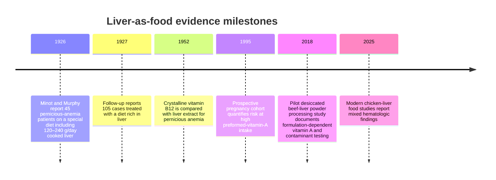

## Summary

Liver is an animal-source food and, after drying or freeze-drying, a heterogeneous tissue-derived supplement rather than a single chemical entity. Nutrient content varies materially with species, preparation, serving size, processing, and product formulation. A 3 oz (85 g) serving of cooked pan-fried beef liver is listed by the U.S. NIH Office of Dietary Supplements as providing 70.7 mcg vitamin B12 and 5 mg iron; the same serving is listed as providing 12,400 mcg copper. These reference values should not be transferred automatically to chicken liver, raw liver, liver extracts, or desiccated powders. [ref-ods-b12] [ref-ods-iron] [ref-ods-copper]

Direct human evidence is much narrower than nutrient-density claims imply. In 1926, Minot and Murphy reported marked hematologic improvement in 45 patients with pernicious anemia receiving a special diet that included 120–240 g/day cooked calf or beef liver, but the intervention also changed meat, vegetables, fruit, fat, energy, and other foods, lacked randomized controls, and the authors explicitly considered spontaneous remission. [ref-minot-murphy-1926] A 1927 follow-up expanded the historical experience to 105 cases. [ref-minot-murphy-1927] Modern work using chicken-liver foods is heterogeneous: a small 2025 quasi-experiment reported increased serum iron without a statistically significant between-group hemoglobin benefit, while a larger cluster-randomized pregnancy trial of chicken-liver-and-eggshell crackers found no significant maternal hemoglobin advantage and had low adherence to the intended exposure. [ref-zuraida-2025] [ref-sistik-2025] These studies do not establish efficacy for commercial desiccated-liver capsules.

Safety is also preparation- and context-specific. Organ meats are sources of preformed vitamin A, and excessive preformed vitamin A can cause birth defects; the U.S. pregnancy UL is 3,000 mcg RAE/day for adults age 19–50. [ref-ods-pregnancy] A prospective cohort linked high preformed-vitamin-A intake in early pregnancy with higher prevalence of cranial-neural-crest defects, although that study was not liver-specific. [ref-rothman-1995] Beef liver is also unusually copper-rich, so repeated high intakes can contribute substantially to total copper exposure. [ref-ods-copper] Product composition cannot be assumed from the words “desiccated liver”: a pilot processing study showed that formulation and blending could substantially alter vitamin A concentration, and contaminant testing is product- and batch-specific. [ref-csiro-desiccated-2018]

## Description

“Liver” here means edible animal liver used as food and dried/desiccated liver tissue used as a dietary supplement. It does **not** mean liver disease, a pharmaceutical liver extract, a purified nutrient isolated from liver, or a single active molecule. Species and preparation must remain explicit because beef, calf, chicken, pork, and other livers differ in nutrient profile, and cooking, freezing, drying, blending, and serving size can change measured composition. [ref-fdc-documentation] [ref-aramouni-godber-1991]

For clinicians and researchers, the key distinction is between **direct intervention evidence** and **nutrient-content inference**. Historical liver-rich diets demonstrated that a food pattern containing large quantities of liver could reverse hematologic abnormalities in pernicious anemia before vitamin B12 was isolated, but those studies cannot isolate liver from the rest of the diet and do not justify modern tissue-extract efficacy claims. Later comparisons of crystalline vitamin B12 with liver extract helped move treatment toward a defined nutrient rather than organ-tissue therapy. [ref-minot-murphy-1926] [ref-murphy-howard-1952] Current clinical guidance for vitamin B12 deficiency uses defined cobalamin replacement; for autoimmune gastritis, NICE recommends lifelong intramuscular vitamin B12 rather than liver as therapy. [ref-nice-b12-2024]

Selected preparation-specific reference values illustrate why “nutrient dense” is accurate but insufficiently specific:

| Preparation and serving | Vitamin B12 | Iron | Copper | Interpretation |
|---|---:|---:|---:|---|
| Beef liver, cooked, pan-fried, 3 oz (85 g) | 70.7 mcg | 5 mg | 12,400 mcg | Reference food-composition values, not a therapeutic dose and not transferable to other species/forms. |
| Desiccated beef-liver powder, pilot process | Product-specific | Product-specific | Product-specific | A pilot processing project deliberately altered vitamin A concentration and performed contaminant testing; commercial products require their own analytical data. |

Sources: [ref-ods-b12] [ref-ods-iron] [ref-ods-copper] [ref-csiro-desiccated-2018]



The timeline is historical context, not a claim that each intervention is equivalent. Whole liver, liver-rich mixed diets, injectable/refined liver extracts, and purified vitamin B12 are distinct exposures. [ref-minot-murphy-1926] [ref-minot-murphy-1927] [ref-murphy-howard-1952] [ref-rothman-1995] [ref-csiro-desiccated-2018] [ref-zuraida-2025] [ref-sistik-2025]

## Evidence note

The strongest direct evidence that liver-containing foods can alter hematologic endpoints comes from historical pernicious-anemia case series and small or formulation-specific modern food trials. The 1926 Minot–Murphy report is clinically dramatic but methodologically weak by modern standards: there was no randomized concurrent control, the “special diet” contained multiple simultaneous dietary changes, adherence measurement varied, and spontaneous remission was a known competing explanation. [ref-minot-murphy-1926] Its historical importance is high; its ability to quantify a liver-specific treatment effect is low.

Modern direct evidence remains heterogeneous:

| Study | Liver exposure | Population/design | Main measured finding | Key limitation for a “liver supplement works” claim |
|---|---|---|---|---|
| Minot & Murphy, 1926 | 120–240 g/day cooked calf or beef liver within a multi-food special diet | 45 pernicious-anemia patients; uncontrolled case series | Mean RBC count rose from 1.47 to 3.40 million/mm³ at about 4–6 weeks; reticulocytosis was observed in monitored patients | No randomization; multiple dietary co-interventions; spontaneous remission explicitly acknowledged |
| Zuraida et al., 2025 | Chicken-liver sausage, formulation F6, 4 weeks | Small quasi-experimental study in anemic adolescent girls | Serum iron improved versus control; between-group hemoglobin change was not significant | Small sample; exact liver dose was not accessible in the inspected article page; short duration |
| SISTIK Growth Study, 2025 | Chicken-liver + powdered-eggshell crackers, intended 75 g/day, pregnancy to 5 months postpartum | Double-blind cluster RCT in Indonesia | No significant maternal hemoglobin advantage at late pregnancy; no clear growth benefit | Multi-ingredient food, low adherence, and not equivalent to ordinary liver or capsules |
| França thesis, 2025 | Beef liver twice weekly for 4 months | Cluster-randomized infant/toddler feeding study reported in a master’s thesis | Within-group hemoglobin increased; anemia prevalence declined in the liver arm | Thesis-level evidence; marked baseline group imbalance; exact liver mass not available in inspected repository abstract |

Sources: [ref-minot-murphy-1926] [ref-zuraida-2025] [ref-sistik-2025] [ref-franca-2025]

No high-quality clinical evidence identified in this review establishes that an unspecified commercial desiccated-liver capsule improves anemia, “energy,” cognition, hormonal status, or general wellness. Nutrient content can make such benefits biologically plausible in a person with a relevant deficiency, but plausibility is not equivalent to product-specific clinical efficacy. The exact-term registry search performed for this review did not identify an isolated “desiccated liver” intervention trial; a separate 2026 registry record involved a multi-ingredient commercial organ supplement and had no posted results, so it cannot establish liver-specific efficacy. [ref-ctgov-whole-package-2026]

Processing can alter nutrient content. In beef liver, broiling and frying caused substantial folate losses in a controlled food-science study, and subsequent frozen storage produced additional losses under some conditions. [ref-aramouni-godber-1991] A later pilot desiccated-beef-liver project showed that a specific processing/blending sequence could markedly reduce vitamin A concentration and that trace-metal and microbiological testing could be performed on the resulting powder. [ref-csiro-desiccated-2018] These findings support product-specific analytical verification rather than assuming fresh-liver composition for a powder.

Contaminant evidence likewise requires context. Finnish food surveillance found low but measurable lead and cadmium concentrations in edible liver, with values differing by species and animal age. [ref-tahvonen-kumpulainen-1994] This establishes that edible liver can carry environmental trace metals; it does **not** demonstrate that current commercial desiccated-liver supplements are contaminated.

## Doses

```yaml
- label: "Historical pernicious-anemia special diet"
  amount: "120–240 g/day cooked calf or beef liver; sometimes more"
  quantity: 120
  quantityMax: 240
  unit: "g/day"
  ingredient: "Calf or beef liver"
  formulation: "Cooked whole liver within a multi-food special diet"
  route: "oral"
  frequency: "daily"
  duration: "At least several weeks; follow-up in the report extended from weeks to months and longer in some patients"
  population: "45 patients with pernicious anemia in the 1926 report"
  purpose: "Historical treatment of pernicious anemia"
  sourceCategory: "research"
  note: "Historical research exposure, not a modern recommendation. The intervention also changed meat, vegetables, fruit, fat, energy intake and other foods, so a liver-specific effect cannot be isolated."
  sourceId: "ref-minot-murphy-1926"
- label: "SISTIK micronutrient-enhanced cracker intervention"
  amount: "Intended 75 g/day of chicken-liver and powdered-eggshell crackers; median pregnancy adherence was approximately 103 g/week of the study cracker"
  quantity: 75
  quantityMax: null
  unit: "g/day"
  ingredient: "Chicken liver within a multi-ingredient cracker"
  formulation: "Micronutrient-enhanced chicken-liver and powdered-eggshell cracker"
  route: "oral"
  frequency: "daily intended"
  duration: "From early pregnancy (7–13 weeks' gestation at enrollment) through 5 months postpartum"
  population: "Pregnant women in 28 Indonesian villages; 324 enrolled, with 137 mother-infant dyads per group completing the reported follow-up"
  purpose: "Improve maternal micronutrient status and maternal/infant outcomes"
  sourceCategory: "research"
  note: "Not a liver-only exposure. Adherence was substantially below the intended amount, and the study food also contained powdered eggshell and other ingredients."
  sourceId: "ref-sistik-2025"
```

## Pharmacokinetics

```yaml
- id: "pk-liver-mixture"
  analyte: "Whole liver/desiccated liver tissue mixture"
  route: "oral"
  formulation: "Whole food or desiccated tissue"
  population: "Humans"
  endpoint: "elimination-half-life"
  statistic: "not-established"
  value: null
  low: null
  high: null
  unit: "hours"
  context: "Liver is a heterogeneous food containing many nutrients and macromolecules with distinct absorption, storage, metabolism and elimination. A single parent-compound half-life is not meaningful."
  sourceId: "ref-fdc-documentation"
  modelEligible: false
```

## Modifiers

```yaml
[]
```

## Effects

```yaml
[]
```

## Outcomes

```yaml
- id: "outcome-minot-rbc-1926"
  conceptId: "red-blood-cell-count"
  name: "Red blood cell count"
  direction: "Increased"
  evidence: "Human research"
  description: "In the 1926 uncontrolled pernicious-anemia series, mean red blood cell count rose during a special diet that included large daily servings of cooked calf or beef liver."
  sourceId: "ref-minot-murphy-1926"
  population: "45 patients with pernicious anemia"
  exposure: "Special diet including 120–240 g/day cooked calf or beef liver, with multiple other dietary changes"
  instrument: "Red blood cell count"
  magnitude: "Mean approximately 1.47 million/mm³ at baseline and 3.40 million/mm³ after about 4–6 weeks; 37 patients followed to about 2 months averaged 4.18 million/mm³."
  reportType: "measured-assessment"
  study:
    id: "minot-murphy-1926"
    design: "Uncontrolled clinical case series"
    sampleSize: 45
    populationLabels:
      - "pernicious anemia"
    comparator: "Baseline and historical/spontaneous-remission context; no randomized concurrent control"
    route: "oral"
    formulation: "Cooked whole liver within multi-food diet"
    assessmentTime: "Approximately 4–6 weeks, with later follow-up in subsets"
- id: "outcome-minot-reticulocytes-1926"
  conceptId: "reticulocyte-percentage"
  name: "Reticulocyte percentage"
  direction: "Increased"
  evidence: "Human research"
  description: "Reticulocytosis preceded the rise in red-cell count in a monitored subset, consistent with increased erythropoietic activity."
  sourceId: "ref-minot-murphy-1926"
  population: "15 monitored patients within the 45-patient pernicious-anemia series"
  exposure: "Special diet including 120–240 g/day cooked calf or beef liver, with multiple other dietary changes"
  instrument: "Peripheral-blood reticulocyte percentage"
  magnitude: "Approximately 1% initially, usually about 8% during response and as high as 15.5% in the report, then declining toward normal by the second week."
  reportType: "measured-assessment"
  study:
    id: "minot-murphy-1926"
    design: "Uncontrolled clinical case series"
    sampleSize: 45
    populationLabels:
      - "pernicious anemia"
    comparator: "Baseline"
    route: "oral"
    formulation: "Cooked whole liver within multi-food diet"
    assessmentTime: "Early treatment response"
- id: "outcome-zuraida-serum-iron-2025"
  conceptId: "serum-iron"
  name: "Serum iron"
  direction: "Increased"
  evidence: "Human research"
  description: "A small 4-week quasi-experimental study of a chicken-liver sausage formulation in anemic adolescent girls reported a significant increase in serum iron in the intervention group and a significant between-group difference in change."
  sourceId: "ref-zuraida-2025"
  population: "Anemic adolescent girls in high school"
  exposure: "Chicken-liver sausage formulation F6 for 4 weeks; exact liver mass per dose was not established from the inspected article page"
  instrument: "Serum iron"
  magnitude: "Intervention within-group p=0.023; control p=0.272; between-group change p=0.026. No effect-size estimate or confidence interval was used here because it was not verified from the inspected source."
  reportType: "measured-assessment"
  study:
    id: "zuraida-2025"
    design: "Quasi-experimental intervention study"
    sampleSize: 30
    populationLabels:
      - "anemic adolescent girls"
    comparator: "Control group"
    route: "oral"
    formulation: "Chicken-liver sausage F6"
    durationDays: 28
    assessmentTime: "4 weeks"
- id: "outcome-zuraida-hemoglobin-2025"
  conceptId: "hemoglobin-concentration"
  name: "Hemoglobin concentration"
  direction: "Variable"
  evidence: "Human research"
  description: "Hemoglobin did not show a statistically significant intervention-specific advantage over control in the small chicken-liver sausage study."
  sourceId: "ref-zuraida-2025"
  population: "Anemic adolescent girls in high school"
  exposure: "Chicken-liver sausage formulation F6 for 4 weeks"
  instrument: "Hemoglobin concentration"
  magnitude: "Hemoglobin increased in the control group (p=0.002) and did not reach conventional significance in the intervention group (p=0.057); the between-group change was not significant (p=0.308)."
  reportType: "measured-assessment"
  study:
    id: "zuraida-2025"
    design: "Quasi-experimental intervention study"
    sampleSize: 30
    populationLabels:
      - "anemic adolescent girls"
    comparator: "Control group"
    route: "oral"
    formulation: "Chicken-liver sausage F6"
    durationDays: 28
    assessmentTime: "4 weeks"
- id: "outcome-sistik-maternal-hemoglobin-2025"
  conceptId: "hemoglobin-concentration"
  name: "Maternal hemoglobin concentration"
  direction: "Variable"
  evidence: "Human research"
  description: "The cluster-randomized SISTIK Growth Study did not demonstrate a significant late-pregnancy maternal hemoglobin advantage for the chicken-liver-and-eggshell cracker versus standard wheat crackers."
  sourceId: "ref-sistik-2025"
  population: "Pregnant women in rural Indonesia"
  exposure: "Micronutrient-enhanced chicken-liver and powdered-eggshell cracker, intended 75 g/day, with substantially lower observed adherence"
  instrument: "Hemoglobin concentration"
  magnitude: "At 35–36 weeks' gestation, reported values were approximately 12.11±0.8 g/dL in the intervention group and 12.22±0.9 g/dL in the comparison group; anemia prevalence was 11.9% versus 11.3%."
  reportType: "measured-assessment"
  study:
    id: "sistik-growth-study"
    design: "Double-blind cluster randomized controlled trial"
    sampleSize: 324
    populationLabels:
      - "pregnancy"
      - "Indonesia"
    comparator: "Standard wheat crackers plus the same programmatic background care"
    route: "oral"
    formulation: "Chicken-liver and powdered-eggshell crackers"
    assessmentTime: "35–36 weeks' gestation"
- id: "outcome-franca-hemoglobin-2025"
  conceptId: "hemoglobin-concentration"
  name: "Hemoglobin concentration"
  direction: "Increased"
  evidence: "Limited research"
  description: "A 2025 Brazilian master's thesis reported higher hemoglobin after a 4-month beef-liver feeding intervention, but the groups were markedly imbalanced at baseline and the inspected repository abstract did not provide a verified adjusted between-group effect."
  sourceId: "ref-franca-2025"
  population: "Children approximately 24–36 months old"
  exposure: "Beef liver twice weekly for 4 months; exact gram amount was not established from the inspected repository abstract"
  instrument: "Hemoglobin concentration"
  magnitude: "Intervention-group mean hemoglobin was reported as 10.73±1.35 to 11.60±0.72 g/dL (p<0.0001); control 11.66 to 11.81 g/dL (p=0.054). Baseline imbalance limits causal interpretation of the within-group contrast."
  reportType: "measured-assessment"
  study:
    id: "franca-2025-thesis"
    design: "Cluster-randomized clinical study reported in a master's thesis"
    sampleSize: 108
    populationLabels:
      - "young children"
      - "Brazil"
    comparator: "Regular meals without the liver intervention"
    route: "oral"
    formulation: "Beef liver"
    durationDays: 120
    assessmentTime: "4 months"
```

## Mechanisms

```yaml
- title: "Vitamin B12 provision"
  description: "Cooked beef liver is extremely rich in vitamin B12. In a person whose hematologic abnormality is caused by inadequate dietary B12 intake and whose absorption is intact, liver can supply cobalamin; this nutrient-content mechanism does not establish efficacy for unspecified liver supplements or overcome intrinsic-factor-dependent malabsorption."
  sourceId: "ref-ods-b12"
- title: "Dietary iron provision"
  description: "Liver supplies dietary iron, including iron in an animal-food matrix. Iron availability can support hemoglobin synthesis when iron deficiency is causal, but anemia has many non-iron causes and food composition alone does not establish treatment efficacy."
  sourceId: "ref-ods-iron"
- title: "Preformed vitamin A exposure"
  description: "Animal liver is a source of preformed vitamin A. The same property that makes liver nutrient-dense creates a dose-dependent safety constraint because excessive preformed vitamin A can be teratogenic, particularly during early pregnancy."
  sourceId: "ref-ods-pregnancy"
- title: "Copper provision and homeostatic limitation"
  description: "Beef liver can deliver copper amounts that are large relative to daily requirements. Fractional copper absorption declines as intake rises, but homeostatic regulation does not justify assuming that very high repeated intake is harmless."
  sourceId: "ref-ods-copper"
```

## Cautions

```yaml
- title: "Pregnancy and preformed vitamin A"
  description: "Organ meats such as liver contain preformed vitamin A. U.S. reference values set the adult-pregnancy UL for preformed vitamin A at 3,000 mcg RAE/day, and excessive preformed vitamin A can cause birth defects. A prospective human cohort found higher cranial-neural-crest defect prevalence at high preformed-vitamin-A intakes, although it was not liver-specific. Ordinary liver servings and concentrated liver products should therefore not be treated as interchangeable with low-retinol foods or beta-carotene sources."
  sourceId: "ref-ods-pregnancy"
- title: "Copper burden"
  description: "A 3 oz serving of cooked pan-fried beef liver is listed at 12,400 mcg copper, which exceeds the U.S. adult UL of 10,000 mcg/day from all sources. This comparison does not prove acute toxicity from a single serving, but it makes serving frequency and total dietary/supplemental copper relevant, especially for concentrated products."
  sourceId: "ref-ods-copper"
- title: "Desiccated products are not compositionally interchangeable"
  description: "Drying, cooking, blending and other processing can change nutrient concentrations. A pilot desiccated beef-liver process reduced vitamin A substantially after processing/blending and tested trace elements and microbiology; those data apply to that process, not to every marketed liver powder."
  sourceId: "ref-csiro-desiccated-2018"
- title: "Environmental trace metals require provenance and batch context"
  description: "Historical food-surveillance studies detected cadmium and occasional lead in edible liver, with concentrations varying by species and age. These data justify product-specific sourcing and analytical quality control but do not establish contamination of current commercial supplements."
  sourceId: "ref-tahvonen-kumpulainen-1994"
- title: "Do not substitute liver for evidence-based B12 replacement in malabsorption"
  description: "For vitamin B12 deficiency caused by autoimmune gastritis or other settings requiring replacement independent of ordinary food absorption, current guidance uses defined vitamin B12 therapy. NICE recommends lifelong intramuscular vitamin B12 for autoimmune gastritis."
  sourceId: "ref-nice-b12-2024"
- title: "Historical anemia response is not a general anti-anemia claim"
  description: "The classic 1926 special diet addressed pernicious anemia and contained multiple co-interventions. It cannot be generalized to iron-deficiency anemia, anemia of inflammation, hemoglobinopathies, kidney disease, bleeding, or other causes, nor to low-dose desiccated-liver capsules."
  sourceId: "ref-minot-murphy-1926"
```

## Claims

```yaml
- id: "claim-liver-rbc-historical"
  assertion: "A historical special diet containing 120–240 g/day cooked calf or beef liver was associated with a large rise in red blood cell count in patients with pernicious anemia."
  relation: "associated-with"
  participants:
    - entityId: "substance:liver"
      role: "exposure"
    - entityId: "tag:red-blood-cell-count"
      role: "measured outcome"
  context: "1926 uncontrolled pernicious-anemia case series using a multi-food special diet"
  sourceIds:
    - "ref-minot-murphy-1926"
  conflictingSourceIds: []
  assessment: "not-formally-assessed"
  limitation: "No randomized concurrent control; liver was only one component of the dietary intervention; spontaneous remission was a recognized alternative explanation."
- id: "claim-liver-serum-iron-modern"
  assertion: "A small modern chicken-liver sausage intervention reported improved serum iron, but did not demonstrate a significant hemoglobin advantage over control."
  relation: "associated-with"
  participants:
    - entityId: "substance:liver"
      role: "food ingredient"
    - entityId: "tag:serum-iron"
      role: "measured outcome"
  context: "4-week quasi-experimental study in anemic adolescent girls"
  sourceIds:
    - "ref-zuraida-2025"
  conflictingSourceIds: []
  assessment: "not-formally-assessed"
  limitation: "Small study, short duration, formulation-specific, and exact liver mass per dose was not verified from the inspected page."
- id: "claim-liver-hemoglobin-evidence-mixed"
  assertion: "Modern liver-containing food interventions do not show a consistent hemoglobin benefit across populations and formulations."
  relation: "evidence-mixed-for"
  participants:
    - entityId: "substance:liver"
      role: "food ingredient"
    - entityId: "tag:hemoglobin-concentration"
      role: "measured outcome"
  context: "Chicken-liver sausage study, pregnancy cluster RCT, and a lower-certainty beef-liver thesis study"
  sourceIds:
    - "ref-zuraida-2025"
    - "ref-sistik-2025"
    - "ref-franca-2025"
  conflictingSourceIds: []
  assessment: "not-formally-assessed"
  limitation: "Different ages, baseline nutritional states, liver species, formulations, co-ingredients, adherence and study designs prevent a pooled liver-specific effect estimate."
```

## Interactions

```yaml
- id: "interaction-liver-preformed-vitamin-a-total-exposure"
  name: "Concurrent sources of preformed vitamin A"
  otherSlug: null
  summary: "Liver, retinol-containing supplements, and other animal-derived preformed-vitamin-A sources contribute additively to total preformed vitamin A exposure. This is especially important in pregnancy because the UL applies to total preformed vitamin A intake rather than to liver alone."
  sourceId: "ref-ods-pregnancy"
  context: "Pregnancy and other high-retinol dietary/supplement contexts"
- id: "interaction-liver-copper-total-exposure"
  name: "Concurrent high-copper foods or supplements"
  otherSlug: null
  summary: "Because beef liver is copper-dense, adding copper-containing supplements or other high-copper foods can materially increase total daily copper exposure. Product-specific liver serving size and measured copper content are therefore relevant."
  sourceId: "ref-ods-copper"
  context: "Repeated intake of beef liver or concentrated liver products"
```

## Experience links

```yaml
[]
```

## References

```yaml
- id: "ref-minot-murphy-1926"
  title: "TREATMENT OF PERNICIOUS ANEMIA BY A SPECIAL DIET"
  authors: "George R. Minot; William P. Murphy"
  year: 1926
  url: "https://jamanetwork.com/journals/jama/article-abstract/242280"
  kind: "primary clinical case series"
  insight: "Forty-five patients with pernicious anemia received a special diet including 120–240 g/day cooked calf or beef liver; hematologic remission was common, but the intervention was multi-component and uncontrolled."
  limitation: "No randomization or concurrent control; diet contained multiple simultaneous changes; adherence measurement varied; spontaneous remission was explicitly acknowledged."
  doi: "10.1001/jama.1926.02680070016005"
  funding: "A grant from the Proctor Fund, Harvard Medical School, for the Study of Chronic Disease was acknowledged."
  sponsorshipStatus: "non-industry-funded"
  conflictsOfInterest: "No modern conflict-of-interest declaration was present in the inspected historical report."
  conflictOfInterestStatus: "not-reported"
  disclosureUrl: "https://www.jameslindlibrary.org/wp-data/uploads/2010/05/Minot_GR_Murphy_WP_1926.pdf"
- id: "ref-minot-murphy-1927"
  title: "A DIET RICH IN LIVER IN THE TREATMENT OF PERNICIOUS ANEMIA: STUDY OF ONE HUNDRED AND FIVE CASES"
  authors: "George R. Minot; William P. Murphy"
  year: 1927
  url: "https://jamanetwork.com/journals/jama/article-abstract/249738"
  kind: "primary clinical follow-up series"
  insight: "Expanded the historical liver-rich dietary treatment experience to 105 pernicious-anemia cases."
  limitation: "Historical uncontrolled evidence; the exposure was a diet rich in liver rather than a standardized isolated liver product."
  doi: "10.1001/jama.1927.02690100021007"
  funding: "Not assessed from an inspected full-text funding statement."
  sponsorshipStatus: "not-assessed"
  conflictsOfInterest: "Not assessed from an inspected full-text disclosure."
  conflictOfInterestStatus: "not-assessed"
- id: "ref-murphy-howard-1952"
  title: "A comparison of the effect of vitamin B12 with that of liver extract in the treatment of pernicious anemia during relapse and for maintenance"
  authors: "W. P. Murphy; I. Howard"
  year: 1952
  url: "https://pubmed.ncbi.nlm.nih.gov/13002627/"
  kind: "comparative clinical study"
  insight: "Historical comparison of crystalline vitamin B12 and liver extract for pernicious anemia, illustrating the transition from organ extract to a defined active nutrient."
  limitation: "The inspected PubMed record did not provide an abstract, and detailed methods/results were not independently reconstructed here."
  pmid: "13002627"
  doi: "10.1056/NEJM195211272472203"
  funding: "Not assessed."
  sponsorshipStatus: "not-assessed"
  conflictsOfInterest: "Not assessed."
  conflictOfInterestStatus: "not-assessed"
- id: "ref-ods-b12"
  title: "Vitamin B12 - Health Professional Fact Sheet"
  authors: "National Institutes of Health, Office of Dietary Supplements"
  year: 2026
  url: "https://ods.od.nih.gov/factsheets/VitaminB12-HealthProfessional/"
  kind: "authoritative nutrient reference"
  insight: "Lists cooked pan-fried beef liver, 3 oz, at 70.7 mcg vitamin B12 and summarizes B12 absorption physiology and dietary sources."
  limitation: "Food-composition reference values do not establish clinical efficacy of liver as treatment and do not characterize every species or processed supplement."
  funding: "U.S. federal health-agency reference publication; study sponsorship is not applicable."
  sponsorshipStatus: "not-assessed"
  conflictsOfInterest: "Not assessed as a clinical-study disclosure."
  conflictOfInterestStatus: "not-assessed"
- id: "ref-ods-iron"
  title: "Iron - Health Professional Fact Sheet"
  authors: "National Institutes of Health, Office of Dietary Supplements"
  year: 2026
  url: "https://ods.od.nih.gov/factsheets/Iron-HealthProfessional/"
  kind: "authoritative nutrient reference"
  insight: "Lists cooked pan-fried beef liver, 3 oz, at approximately 5 mg iron and summarizes heme/nonheme iron absorption and iron homeostasis."
  limitation: "Composition and absorption physiology do not prove that liver treats anemia of any specific cause."
  funding: "U.S. federal health-agency reference publication; study sponsorship is not applicable."
  sponsorshipStatus: "not-assessed"
  conflictsOfInterest: "Not assessed as a clinical-study disclosure."
  conflictOfInterestStatus: "not-assessed"
- id: "ref-ods-copper"
  title: "Copper - Health Professional Fact Sheet"
  authors: "National Institutes of Health, Office of Dietary Supplements"
  year: 2026
  url: "https://ods.od.nih.gov/factsheets/Copper-HealthProfessional/"
  kind: "authoritative nutrient reference"
  insight: "Lists cooked pan-fried beef liver, 3 oz, at 12,400 mcg copper and summarizes copper intake, absorption and upper-limit context."
  limitation: "The reference value is preparation-specific and does not quantify the copper content of an unspecified desiccated-liver product."
  funding: "U.S. federal health-agency reference publication; study sponsorship is not applicable."
  sponsorshipStatus: "not-assessed"
  conflictsOfInterest: "Not assessed as a clinical-study disclosure."
  conflictOfInterestStatus: "not-assessed"
- id: "ref-ods-pregnancy"
  title: "Dietary Supplements and Life Stages: Pregnancy - Health Professional Fact Sheet"
  authors: "National Institutes of Health, Office of Dietary Supplements"
  year: 2026
  url: "https://ods.od.nih.gov/factsheets/Pregnancy-HealthProfessional/"
  kind: "authoritative pregnancy nutrient reference"
  insight: "Gives pregnancy RDAs and ULs, including a 3,000 mcg/day UL for preformed vitamin A and a 10,000 mcg/day copper UL for adults age 19–50, and notes that excessive preformed vitamin A can cause birth defects."
  limitation: "The guidance is nutrient-based, not a product-specific evaluation of liver foods or supplements."
  funding: "U.S. federal health-agency reference publication; study sponsorship is not applicable."
  sponsorshipStatus: "not-assessed"
  conflictsOfInterest: "Not assessed as a clinical-study disclosure."
  conflictOfInterestStatus: "not-assessed"
- id: "ref-rothman-1995"
  title: "Teratogenicity of high vitamin A intake"
  authors: "K. J. Rothman; L. L. Moore; M. R. Singer; U. S. Nguyen; S. Mannino; A. Milunsky"
  year: 1995
  url: "https://pubmed.ncbi.nlm.nih.gov/7477116/"
  kind: "prospective observational cohort"
  insight: "Among 22,748 pregnancies, high preformed-vitamin-A intake was associated with increased prevalence of defects involving cranial-neural-crest-derived tissues; risk was concentrated with high early-pregnancy exposure."
  limitation: "Observational and not liver-specific; exposure combined food and/or supplements, so it cannot quantify the risk of any particular liver serving."
  pmid: "7477116"
  doi: "10.1056/NEJM199511233332101"
  funding: "Not assessed from an inspected full-text funding disclosure."
  sponsorshipStatus: "not-assessed"
  conflictsOfInterest: "Not assessed from an inspected full-text disclosure."
  conflictOfInterestStatus: "not-assessed"
- id: "ref-aramouni-godber-1991"
  title: "FOLATE LOSSES IN BEEF LIVER DUE TO COOKING AND FROZEN STORAGE"
  authors: "F. M. Aramouni; J. S. Godber"
  year: 1991
  url: "https://doi.org/10.1111/j.1745-4557.1991.tb00077.x"
  kind: "food-composition experiment"
  insight: "Broiling and frying caused substantial folate losses in beef liver, with additional losses during some frozen-storage conditions."
  limitation: "Food-science composition study; it did not test clinical outcomes or desiccated supplement products."
  doi: "10.1111/j.1745-4557.1991.tb00077.x"
  funding: "Not assessed."
  sponsorshipStatus: "not-assessed"
  conflictsOfInterest: "Not assessed."
  conflictOfInterestStatus: "not-assessed"
- id: "ref-tahvonen-kumpulainen-1994"
  title: "Lead and cadmium contents in pork, beef and chicken, and in pig and cow liver in Finland during 1991"
  authors: "R. Tahvonen; J. Kumpulainen"
  year: 1994
  url: "https://doi.org/10.1080/02652039409374243"
  kind: "food-surveillance study"
  insight: "Measured low but detectable lead and cadmium in Finnish meats and livers, with liver concentrations varying by species and animal age."
  limitation: "Country- and period-specific food monitoring; does not establish contamination of current liver supplements."
  doi: "10.1080/02652039409374243"
  funding: "Not assessed from an inspected funding statement."
  sponsorshipStatus: "not-assessed"
  conflictsOfInterest: "Not assessed from an inspected disclosure."
  conflictOfInterestStatus: "not-assessed"
- id: "ref-csiro-desiccated-2018"
  title: "Food Safety Risk Assessment of the processing of the desiccated beef liver powder"
  authors: "Sieh Ng; Cathy Moir; Henry Sabarez"
  year: 2018
  url: "https://www.researchgate.net/publication/330510907_Food_Safety_Risk_Assessment_of_the_processing_of_the_desiccated_beef_liver_powder"
  kind: "conference poster / pilot food-processing study"
  insight: "A specified cook/oil-treatment/freeze-dry/blending process materially changed vitamin A concentration and included trace-element and microbiological testing, demonstrating strong formulation dependence."
  limitation: "Conference-poster-level evidence, process-specific, not a clinical trial and not a survey of commercial products."
  funding: "Funded by Meat & Livestock Australia."
  sponsorshipStatus: "industry-funded"
  conflictsOfInterest: "No explicit conflict-of-interest declaration was identified in the inspected poster record."
  conflictOfInterestStatus: "not-reported"
  disclosureUrl: "https://www.researchgate.net/publication/330510907_Food_Safety_Risk_Assessment_of_the_processing_of_the_desiccated_beef_liver_powder"
- id: "ref-zuraida-2025"
  title: "The Effectiveness of Chicken Liver Sausage Consumption on Increasing Hemoglobin and Iron Levels in Anemic Adolescent Girls in High School"
  authors: "R. Zuraida; D. I. Angraini; A. E. Yunianto; T. Ernawaty; Meiyanti; R. Yana"
  year: 2025
  url: "https://juke.kedokteran.unila.ac.id/index.php/JK/article/view/3734"
  kind: "quasi-experimental human intervention study"
  insight: "Four weeks of a chicken-liver sausage formulation increased serum iron relative to control, while the between-group hemoglobin change was not significant."
  limitation: "Small sample, short duration, quasi-experimental design, and exact liver mass per exposure was not verified from the inspected article page."
  doi: "10.23960/jkunila.v9i2.pp329-333"
  funding: "Not assessed from an accessible full-text funding declaration."
  sponsorshipStatus: "not-assessed"
  conflictsOfInterest: "Not assessed from an accessible full-text disclosure."
  conflictOfInterestStatus: "not-assessed"
- id: "ref-sistik-2025"
  title: "Chicken liver and eggshell crackers are a safe and affordable animal source food for overcoming micronutrient deficits during pregnancy and lactation in Indonesia: a double-blind, cluster randomized controlled trial (SISTIK Growth Study)"
  authors: "Aly Diana; Sofa Rahmannia; Yenni Zuhairini Suhadi; Dimas Erlangga Luftimas; Haidar Rizqi; Afini Dwi Purnamasari; Ayunda Jihadillah; Mohammad Brachim Ansari; Dearly Ayu Zahrotun Haq; Aisyah Nur Pratiwi; Dina Novtyana Puspita; Yeni Intan Kusuma Dewi Affandy; Christopher M. A. Frampton; Umi Fahmida; Lisa A. Houghton; Rosalind S. Gibson"
  year: 2025
  url: "https://pubmed.ncbi.nlm.nih.gov/40770284/"
  kind: "double-blind cluster randomized controlled trial"
  insight: "A chicken-liver-and-eggshell cracker intervention from early pregnancy through 5 months postpartum did not show a significant maternal hemoglobin advantage at late pregnancy; study batches underwent vitamin A, heavy-metal and microbiological safety testing."
  limitation: "Multi-ingredient intervention, adherence was far below the intended 75 g/day, and results cannot be attributed to liver alone or generalized to ordinary liver servings or supplements."
  pmid: "40770284"
  doi: "10.1186/s12884-025-07899-0"
  funding: "Supported by Wellcome Trust and the UK Department of Health and Social Care/NIHR under grant 216447/Z/19/Z; the article reports that funders had no role in study conduct or reporting."
  sponsorshipStatus: "non-industry-funded"
  conflictsOfInterest: "The authors declared no competing interests."
  conflictOfInterestStatus: "none-declared"
  disclosureUrl: "https://pmc.ncbi.nlm.nih.gov/articles/PMC12330069/"
- id: "ref-franca-2025"
  title: "Uso de fígado bovino reduz anemia em lactentes: um ensaio clínico randomizado"
  authors: "Lídia Maria de Sousa França"
  year: 2025
  url: "https://repositorio.ufc.br/handle/riufc/84414"
  kind: "master's thesis / randomized clinical study"
  insight: "Repository abstract reports improved hemoglobin after beef-liver feeding twice weekly for 4 months in young children."
  limitation: "Thesis-level evidence; substantial baseline group imbalance; exact liver mass and a verified adjusted between-group effect were not available in the inspected abstract."
  funding: "Not assessed from the full thesis."
  sponsorshipStatus: "not-assessed"
  conflictsOfInterest: "Not assessed from the full thesis."
  conflictOfInterestStatus: "not-assessed"
- id: "ref-nice-b12-2024"
  title: "Vitamin B12 deficiency in over 16s: diagnosis and management"
  authors: "National Institute for Health and Care Excellence (NICE)"
  year: 2024
  url: "https://www.nice.org.uk/guidance/ng239/chapter/recommendations"
  kind: "clinical guideline"
  insight: "Recommends defined vitamin B12 replacement based on cause; lifelong intramuscular replacement is recommended for autoimmune gastritis rather than food-based liver therapy."
  limitation: "Guideline for vitamin B12 deficiency management, not an evaluation of liver foods as general nutrition."
  funding: "Public clinical-guideline program; trial sponsorship not applicable."
  sponsorshipStatus: "not-assessed"
  conflictsOfInterest: "Guideline conflict-management processes apply; not coded here as a single study-level COI declaration."
  conflictOfInterestStatus: "not-assessed"
- id: "ref-fdc-documentation"
  title: "Data Documentation | USDA FoodData Central"
  authors: "U.S. Department of Agriculture, Agricultural Research Service"
  year: 2026
  url: "https://fdc.nal.usda.gov/data-documentation/"
  kind: "authoritative food-composition database documentation"
  insight: "Documents the USDA food-composition data system used to characterize foods as multi-component matrices with preparation-specific nutrient records."
  limitation: "Database documentation is not a clinical study and cannot supply a meaningful whole-food elimination half-life."
  funding: "U.S. federal government data program."
  sponsorshipStatus: "not-assessed"
  conflictsOfInterest: "Not applicable as a clinical-study disclosure."
  conflictOfInterestStatus: "not-assessed"
- id: "ref-fda-dietary-supplements-2026"
  title: "Questions and Answers on Dietary Supplements"
  authors: "U.S. Food and Drug Administration"
  year: 2026
  url: "https://www.fda.gov/food/information-consumers-using-dietary-supplements/questions-and-answers-dietary-supplements"
  kind: "official regulatory guidance"
  insight: "Explains that FDA does not preapprove dietary supplements before marketing, firms bear initial responsibility for safety and labeling compliance, and current good manufacturing practices apply."
  limitation: "General U.S. dietary-supplement regulation; not a finding about any specific liver product's quality or efficacy."
  funding: "U.S. federal regulatory publication."
  sponsorshipStatus: "not-assessed"
  conflictsOfInterest: "Not applicable as a clinical-study disclosure."
  conflictOfInterestStatus: "not-assessed"
- id: "ref-ctgov-whole-package-2026"
  title: "Evaluating Heart & Soil's Whole Package on Men's Health"
  authors: "ClinicalTrials.gov; sponsor: Efforia, Inc."
  year: 2026
  url: "https://clinicaltrials.gov/study/NCT07256639"
  kind: "clinical-trial registry record"
  insight: "Registry record for a 100-participant study of a branded multi-ingredient organ supplement; it was active, not recruiting, and had no posted results when inspected."
  limitation: "Multi-ingredient product, sponsor-submitted registry information, not a liver-only trial, and no posted results; cannot establish efficacy."
  funding: "Commercial-product study; detailed funding role was not independently assessed beyond the registry sponsor information."
  sponsorshipStatus: "not-assessed"
  conflictsOfInterest: "Not assessed."
  conflictOfInterestStatus: "not-assessed"
```

## Legal

```yaml
- jurisdiction: "United States"
  activity: "Marketing as a dietary supplement"
  status: "Dietary supplements are regulated under the federal food/dietary-supplement framework; FDA does not preapprove them for safety or effectiveness before marketing. Manufacturers and distributors have initial responsibility for lawful composition, safety, labeling and claims, and disease-treatment claims can cause a product to be regulated as a drug."
  sourceUrl: "https://www.fda.gov/food/information-consumers-using-dietary-supplements/questions-and-answers-dietary-supplements"
  asOf: '2026-10-04'
```
